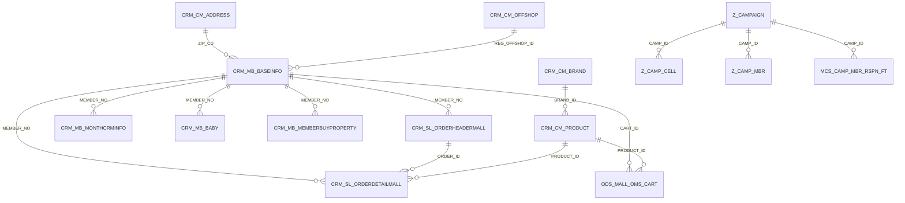

# 테이블 관계도 (활성 사용 테이블)

> 자동 생성: `build_table_relationships.py`. 수정은 스크립트의 `RELATIONSHIPS` 를 고칠 것.

CRMDW 에는 선언된 외래키가 없어, 아래 관계는 결정론 빌더의 실제 조인(verified)·기존 join_hints(human_hint)·동일 키 추론(inferred)에서 큐레이션했다.

## 관계 출처

| child.컬럼 | → | parent.컬럼 | 신뢰도 | 출처 |
|---|---|---|---|---|
| `CRM_SL_ORDERHEADERMALL.MEMBER_NO` | → | `CRM_MB_BASEINFO.MEMBER_NO` | verified | sql_builder:order_count_targets |
| `CRM_SL_ORDERDETAILMALL.MEMBER_NO` | → | `CRM_MB_BASEINFO.MEMBER_NO` | verified | sql_builder:purchase_history_targets |
| `CRM_MB_MONTHCRMINFO.MEMBER_NO` | → | `CRM_MB_BASEINFO.MEMBER_NO` | verified | sql_builder:dense_region_targets |
| `CRM_MB_BABY.MEMBER_NO` | → | `CRM_MB_BASEINFO.MEMBER_NO` | inferred | shared_key:MEMBER_NO |
| `CRM_MB_MEMBERBUYPROPERTY.MEMBER_NO` | → | `CRM_MB_BASEINFO.MEMBER_NO` | inferred | shared_key:MEMBER_NO |
| `ODS_MALL_OMS_CART.CART_ID` | → | `CRM_MB_BASEINFO.MEMBER_ID` | verified | sql_builder:cart_targets |
| `ODS_MALL_OMS_CART.PRODUCT_ID` | → | `CRM_CM_PRODUCT.PRODUCT_ID` | verified | sql_builder:cart_dimension_targets |
| `CRM_MB_BASEINFO.ZIP_CD` | → | `CRM_CM_ADDRESS.ZIP_CODE` | human_hint | join_hint |
| `CRM_MB_BASEINFO.REG_OFFSHOP_ID` | → | `CRM_CM_OFFSHOP.OFFSHOP_ID` | human_hint | join_hint |
| `CRM_SL_ORDERDETAILMALL.ORDER_ID` | → | `CRM_SL_ORDERHEADERMALL.ORDER_ID` | verified | live_join_check:200of200 |
| `CRM_SL_ORDERDETAILMALL.PRODUCT_ID` | → | `CRM_CM_PRODUCT.PRODUCT_ID` | verified | sql_builder:purchase_history_targets |
| `CRM_CM_PRODUCT.BRAND_ID` | → | `CRM_CM_BRAND.BRAND_ID` | verified | live_join_check |
| `Z_CAMP_CELL.CAMP_ID` | → | `Z_CAMPAIGN.CAMP_ID` | inferred | shared_key_live:CAMP_ID |
| `Z_CAMP_MBR.CAMP_ID` | → | `Z_CAMPAIGN.CAMP_ID` | inferred | shared_key_live:CAMP_ID |
| `MCS_CAMP_MBR_RSPN_FT.CAMP_ID` | → | `Z_CAMPAIGN.CAMP_ID` | inferred | shared_key_live:CAMP_ID |
