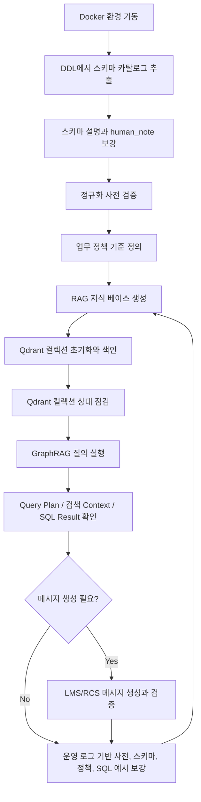
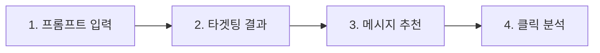

# 현재 프로젝트 프로세스

이 문서는 캠페인 추천/NL2SQL RAG 프로젝트를 처음 구축하고 실행할 때의 전체 순서를 정리한다. MCP 연결 절차가 아니라, 현재 코드와 `docs/data` 산출물을 기준으로 한 프로젝트 운영 프로세스다.

## 1. 전체 흐름 요약



현재 프로젝트는 크게 두 개의 흐름으로 나뉜다.

| 구분          | 목적                                                                                                    | 주요 파일                                                                                                                                                       |
| ------------- | ------------------------------------------------------------------------------------------------------- | --------------------------------------------------------------------------------------------------------------------------------------------------------------- |
| 구축 프로세스 | 검색, SQL 생성, 메시지 생성을 위한 지식 데이터를 만든 뒤 Qdrant에 색인하고 상태를 점검한다.             | `schema_extract.py`, `build_rag_knowledge.py`, `rag_index.py`, `init_rag_collections.py`, `check_rag_collections.py`, `docs/data/business_policies.sample.json` |
| 질의 프로세스 | 사용자 질문을 Query Plan으로 바꾸고, 검색 context, 검증된 SQL/API 응답, 선택적 LMS/RCS 메시지를 만든다. | `graph_rag.py`, `ingest.py`, `set_expression_engine.py`, `sql_guard.py`, `docs/prompts/message_generation_*.txt`                                                |

## 1.1 화면 기준 사용자 실행 흐름

현재 화면은 운영자가 캠페인 목표만 입력하면 타겟, 메시지, 클릭 분석까지 이어지는 4단계 wizard로 본다.



| 화면 단계        | 운영자 행동                                                                                     | 시스템 처리                                                                                                                     | 대표 API                                                                             |
| ---------------- | ----------------------------------------------------------------------------------------------- | ------------------------------------------------------------------------------------------------------------------------------- | ------------------------------------------------------------------------------------ |
| 1. 프롬프트 입력 | 자연어 캠페인 목표를 입력하고 LMS/RCS 발송 채널을 선택한다. 예시 chip은 프롬프트 초안만 채운다. | 채널 값은 메시지 생성 채널로 전달하고, 프롬프트는 Query Plan과 타겟 SQL 생성 입력이 된다.                                       | `POST /target-sql`                                                                   |
| 2. 타겟팅 결과   | 세그먼트 구성, 캠페인 카테고리, 캠페인 채널, 실행 SQL을 확인한다.                               | 검증된 read-only SQL을 PostgreSQL에 실행하고, 결과를 타겟 오디언스 스냅샷으로 저장한다.                                         | `GET /target-audiences/{audience_id}`, `GET /target-audiences/{audience_id}/members` |
| 3. 메시지 추천   | 선택 채널에 맞는 메시지 3종을 확인하고 클릭률 예측 단계로 넘긴다.                               | 선택 채널, 캠페인 offer, 타겟 컨텍스트를 기준으로 `benefit_emphasis`, `urgency_emphasis`, `emotion_emphasis` 3개 문안을 만든다. | `POST /channel-messages` 또는 `/target-sql`의 `generate_messages=true`               |
| 4. 클릭 분석     | 실험 ID, 배정/스킵 수, 분석 신뢰도, 수집 상태, variant별 문안과 AI 특징을 확인한다.             | A/B/C variant를 실험에 등록하고 대상 사용자를 배정한다. 이벤트가 부족하면 `발송 준비` 또는 `데이터 수집 대기` 상태로 보여준다.  | `POST /campaign-experiments/run`, `POST /ai/ctr/analyze`                             |

프론트 화면에서 단계 이동 버튼은 다음 계약을 따른다.

- `타겟팅 분석하기`: `prompt`, `message_channel`, `execute_sql=true`, `persist_targeting=true`로 `/target-sql`을 호출한다.
- `메시지 추천 받기`: 타겟팅 결과의 캠페인/오디언스 컨텍스트와 선택 채널로 메시지 3종을 요청한다. 별도 API를 쓰면 `/channel-messages`, 한 번에 처리하려면 `/target-sql`의 `generate_messages=true`를 사용한다.
- `클릭률 예측 보기`: 추천된 3개 메시지를 A/B/C variant로 변환해 `/campaign-experiments/run`을 호출한다. 응답의 `experimentId`, `createdAssignmentCount`, `skippedAssignmentCount`, `analysis`가 4단계 카드의 기준 데이터다.
- 클릭/도달 이벤트가 충분하지 않으면 4단계는 승자 확정 화면이 아니라 `클릭 데이터 수집 대기`와 현재 선택 지표를 보여준다. LMS는 `delivered_ctr_pct`, RCS처럼 impression 추적이 가능한 채널은 `ctr_pct`를 우선 지표로 쓴다.

## 2. 구축 프로세스

### 2.1 Docker 실행 환경 기동

Docker Compose 명령은 `docker-compose.yml`이 있는 프로젝트 루트에서 실행한다.

```powershell
Set-Location C:\PROJECT\sample
```

다른 폴더에서 실행하면 Docker Compose가 설정 파일을 찾지 못해 `no configuration file provided: not found`가 발생한다. 프로젝트 루트로 이동하지 않고 실행해야 한다면 Compose 파일과 project directory를 직접 지정한다.

```powershell
docker compose -f C:\PROJECT\sample\docker-compose.yml --project-directory C:\PROJECT\sample config --services
```

```bash
docker compose up -d qdrant postgres
```

왜 이걸 쓰는가:

- `docker-compose.yml`이 Qdrant, PostgreSQL, Python 실행 환경을 같이 정의한다.
- Qdrant는 벡터 검색 컬렉션 저장소로 필요하다.
- PostgreSQL은 DDL과 SQL 검증/실행 흐름의 기준 DB로 둔다. 현재 코드의 핵심 검색은 Qdrant 중심이지만, 운영 단계에서는 생성 SQL을 실제 DB에서 검증할 수 있어야 한다.
- 로컬 Python 환경 차이를 줄이기 위해 실행 예시는 Docker의 `python` 서비스 사용을 기본으로 둔다.
- 현재 로컬 `python.exe`는 Windows Store placeholder일 수 있으므로 검증 명령도 Docker Python 서비스를 기본으로 사용한다.

### 2.2 OpenAI 환경 변수 설정

LLM Query Parser, 답변 생성, LMS/RCS 메시지 생성을 실제 OpenAI 호출로 실행하려면 프로젝트 루트의 `.env`에 API 키를 둔다.

```env
OPENAI_API_KEY=발급받은_키
OPENAI_MODEL=gpt-4o-mini
MESSAGE_GENERATION_OPENAI_TIMEOUT_SECONDS=15
```

`MESSAGE_GENERATION_OPENAI_TIMEOUT_SECONDS`는 LMS/RCS 메시지 variant별 OpenAI 호출 timeout이다. 값을 생략하면 15초를 사용한다. 메시지 품질보다 응답시간 상한이 더 중요하면 이 값을 낮추고, 네트워크 지연이 잦은 환경에서는 높인다.

`docker-compose.yml`의 `python` 서비스는 `env_file: .env` 설정으로 이 값을 컨테이너에 주입한다. 키 자체를 출력하지 말고 로드 여부만 확인한다.

```bash
docker compose run --rm python python -c "import os; print('OPENAI_API_KEY loaded=' + str(bool(os.getenv('OPENAI_API_KEY'))))"
```

왜 이걸 쓰는가:

- API 키를 명령줄 인자로 넘기면 터미널 기록에 남을 수 있다.
- `.env`를 Compose에서 읽게 하면 OpenAI 호출 코드가 기존 `os.getenv("OPENAI_API_KEY")` 경로를 그대로 사용한다.
- 키가 없으면 `--query-parser auto`는 규칙 기반 parser로 fallback하고, `--generate-answer`/`--generate-messages`는 실패 사유를 응답에 남긴다.

### 2.3 DDL에서 스키마 카탈로그 생성

```bash
docker compose run --rm python python schema_extract.py docs/data/ddl.sql --output docs/data/schema_catalog.json
```

왜 이걸 쓰는가:

- `schema_extract.py`는 `CREATE TABLE`, `CREATE INDEX`, PK/FK/check 제약을 DDL에서 자동 추출한다.
- 테이블명, 컬럼명, 타입, 키, 인덱스처럼 틀리면 안 되는 구조 정보는 사람이 직접 쓰거나 LLM이 생성하지 않게 한다.
- 기존 `schema_catalog.json`이 있으면 `description_llm`과 `human_note`를 보존하므로, 재추출해도 사람이 보강한 설명을 덮어쓰지 않는다.

### 2.4 스키마 설명과 중요 컬럼 메모 보강

수정 대상:

- `docs/data/schema_catalog.json`의 `description_llm`
- `important: true` 컬럼의 `human_note`

왜 이걸 쓰는가:

- GraphRAG 검색은 스키마 노드의 `text_for_embedding`을 사용한다.
- 테이블 설명과 중요 컬럼 메모가 좋아질수록 자연어 질문이 올바른 테이블/컬럼으로 이어질 확률이 높아진다.
- 모든 컬럼을 사람이 관리하면 유지보수 비용이 커지므로, 중요한 컬럼만 보강하는 정책을 둔다.

### 2.5 정규화 사전 검증

```bash
docker compose run --rm python python ingest.py docs/data/normalization_rules.sample.json --text "20대 여성 장바구니 이탈 고객에게 쿠폰 캠페인 추천"
```

LMS/RCS 메시지 채널 정규화도 확인한다.

```bash
docker compose run --rm python python ingest.py docs/data/normalization_rules.sample.json --text "RCS로 장바구니 이탈 고객에게 메시지 만들어줘"
```

필요하면 사전 인덱스도 확인한다.

```bash
docker compose run --rm python python ingest.py docs/data/normalization_rules.sample.json --dump-index
```

왜 이걸 쓰는가:

- `ingest.py`는 한국어 표현, 영어 표현, 부정 동의어를 canonical 값으로 바꾼다.
- `graph_rag.py`의 Query Planning은 이 정규화 결과를 사용해 `gender`, `behavior`, `category`, `offer_type`, `channels` 같은 조건을 채운다.
- SQL 템플릿은 canonical 조건 토큰을 기준으로 조립되므로, 사전 검증이 검색 품질과 SQL 조건 커버리지의 출발점이다.

### 2.6 업무 정책 기준 정의

수정 대상:

- `docs/data/business_policies.sample.json`

왜 이걸 쓰는가:

- `매출이 가장 높은`, `고매출`, `예산이 큰`처럼 운영 기준이 필요한 표현을 코드에 하드코딩하지 않기 위해 별도 파일로 둔다.
- `지역`처럼 여러 의미를 가질 수 있는 표현의 기본 해석과 clarification 조건도 같은 파일에서 관리한다.
- `sql_behavior=rank` 정책은 기준 금액 없이 ORDER BY로 처리한다.
- `sql_behavior=filter` 정책은 `threshold_krw`가 숫자로 정의되어 있을 때만 WHERE 조건으로 처리한다.
- `sql_behavior=disambiguation` 정책은 기본 컬럼을 SELECT에 반영하거나, 대체 의미가 명시됐지만 스키마가 없으면 clarification을 반환한다.
- `threshold_krw`가 `null`이면 GraphRAG는 임의로 3000만원 같은 값을 만들지 않고, 정책 파일에 기준 금액을 정의하라는 clarification을 반환한다.
- `channel_message_generation` 정책은 LMS/RCS 메시지 생성의 기본 채널, 허용 채널, 글자 수 제한, 필수 variant, 혜택 hallucination 방지 기준을 관리한다.

예시:

```json
{
  "policy_id": "high_revenue_user",
  "canonical": "high_revenue_user",
  "ko_label": "고매출 고객",
  "expression": "u.avg_order_value_krw * u.purchase_count_90d",
  "operator": ">=",
  "threshold_krw": null,
  "requires_threshold": true,
  "sql_behavior": "filter"
}
```

지역 의미 해석 예시:

```json
{
  "policy_id": "region_context_default",
  "canonical": "region_context_default",
  "ko_label": "지역 표현 기본 해석",
  "default_column": "users.region",
  "default_select": "u.region",
  "sql_behavior": "disambiguation"
}
```

메시지 생성 정책 예시:

```json
{
  "policy_id": "channel_message_generation",
  "canonical": "channel_message_generation",
  "scope": "message_generation",
  "default_channel": "lms",
  "allowed_channels": ["lms", "rcs"],
  "required_variants": [
    "benefit_emphasis",
    "urgency_emphasis",
    "emotion_emphasis"
  ],
  "sql_behavior": "context"
}
```

### 2.7 세그먼트 집합식 처리

관련 파일:

- `set_expression_engine.py`
- `docs/data/normalization_rules.sample.json`

왜 이걸 쓰는가:

- `(A+B)*C-D` 같은 표현에서 A/B/C/D가 고객 세그먼트라면 산술 계산이 아니라 집합 연산으로 해석한다.
- `+`는 합집합, `*`는 교집합, `-`는 차집합이다.
- `합집합`, `또는`, `교집합`, `그리고`, `차집합`, `제외`, `빼고` 같은 자연어 연산자도 같은 AST로 정규화한다.
- 집합식에 들어간 canonical 값은 일반 Query Plan 조건으로 중복 적용하지 않고, `set_expressions.set_ast`에서 하나의 최적화된 SQL predicate로 컴파일한다.
- 합집합은 최종 SQL에서 `OR`, 교집합은 `AND`, 차집합은 `AND NOT`으로 낮추고, 별도 사용자 속성 테이블이 필요한 조건은 `EXISTS` semijoin으로 표현한다.

예시:

```bash
docker compose run --rm python python graph_rag.py "(여성 고객 + VIP 고객) * 쿠폰 관심 고객 - 휴면 고객" --format json
```

생성되는 최종 SQL predicate 의미:

```sql
SELECT DISTINCT ...
FROM users u
WHERE (((u.gender = 'female' OR u.lifecycle = 'vip')
  AND u.price_sensitivity = 'high')
  AND NOT (u.lifecycle = 'inactive_90d'))
```

### 2.8 계산 지표 별칭 정의

수정 대상:

- `docs/data/metric_lexicon.sample.json`

왜 이걸 쓰는가:

- `평균주문금액`, `객단가`, `구매횟수`, `예산` 같은 자연어 지표명을 숫자형 스키마 컬럼으로 연결한다.
- 사용자가 `평균주문금액과 구매횟수를 곱한 값`처럼 숫자 지표 계산을 명시하면 GraphRAG가 `computed_metrics.formula_ast`를 만든다.
- `formula_engine.py`는 스키마에 있는 숫자형 컬럼과 `+`, `-`, `*`, `/` 연산자만 허용하고, 검증된 계산식만 SQL expression으로 컴파일한다.
- 계산식 자체를 모두 정책 파일에 미리 넣지 않고, 자연어 지표 별칭만 운영 데이터로 보강한다.

예시:

```json
{
  "metric_id": "avg_order_value_krw",
  "canonical": "avg_order_value_krw",
  "ko_label": "평균주문금액",
  "table": "users",
  "column": "avg_order_value_krw",
  "synonyms": ["객단가", "평균 주문 금액", "aov"]
}
```

### 2.9 RAG 지식 베이스 생성

```bash
docker compose run --rm python python build_rag_knowledge.py \
  --schema docs/data/schema_catalog.json \
  --normalization docs/data/normalization_rules.sample.json \
  --business-policies docs/data/business_policies.sample.json \
  --metric-lexicon docs/data/metric_lexicon.sample.json \
  --sql-examples docs/data/sql_examples.sample.sql \
  --output docs/data/rag_knowledge_base.json
```

왜 이걸 쓰는가:

- `build_rag_knowledge.py`는 스키마, 정규화 사전, 비즈니스 용어, 업무 정책, 계산 지표 별칭, SQL 예시를 하나의 RAG 지식 노드 JSON으로 합친다.
- `graph_rag.py`는 이 파일을 읽어 NetworkX 그래프를 만들고, Qdrant의 `campaign_knowledge_rag` 컬렉션과 함께 검색한다.
- 업무 정책은 `business_policy` 노드로 생성되고 관련 테이블/컬럼과 graph edge로 연결된다.
- 계산 지표 별칭은 `metric_alias` 노드로 생성되고 관련 숫자형 컬럼과 graph edge로 연결된다.
- `campaign_message_examples`, `campaign_channel_messages`, `campaign_experiments`, `campaign_message_variants`, `campaign_message_deliveries`, `campaign_message_events`, 성과 view, `channel_message_generation`, `channel_message`, `brand_tone`도 지식 노드와 그래프 관계에 반영된다.
- SQL 예시는 최종 SQL을 그대로 복사하기 위한 용도가 아니라, 검색 context와 대표 패턴 설명을 제공하기 위한 근거 자료로 쓴다.

### 2.10 입력 데이터 사전 검증

```bash
docker compose run --rm python python init_rag_collections.py --validate-only --skip-knowledge-build
```

왜 이걸 쓰는가:

- `init_rag_collections.py`는 사용자/캠페인 샘플 노드와 지식 노드 두 입력을 함께 검사한다.
- `--validate-only`는 임베딩 생성이나 Qdrant 쓰기 없이 노드 개수, 타입 분포, 샘플 ID를 확인한다.
- 색인 전에 JSON 구조 오류를 빨리 잡을 수 있어 비용이 낮다.

### 2.11 Qdrant 컬렉션 초기화와 색인

```bash
docker compose run --rm python python init_rag_collections.py --recreate
```

왜 이걸 쓰는가:

- 이 명령은 기본적으로 `docs/data/rag_knowledge_base.json`을 다시 만든 뒤 두 컬렉션을 색인한다.
- `campaign_user_rag_nodes`에는 캠페인/사용자 샘플 노드와 추천 edge payload가 들어간다.
- `campaign_knowledge_rag`에는 스키마, 정규화 사전, 비즈니스 용어, 업무 정책, 계산 지표 별칭, SQL 예시 노드가 들어간다.
- `--recreate`는 컬렉션을 삭제 후 재생성하므로, 샘플 데이터나 지식 베이스가 크게 바뀐 뒤 일관된 상태로 맞출 때 적합하다.

### 2.12 Qdrant 컬렉션 상태 점검

```bash
docker compose run --rm python python check_rag_collections.py --strict
```

왜 이걸 쓰는가:

- `check_rag_collections.py`는 Qdrant에 실제 생성된 `campaign_user_rag_nodes`, `campaign_knowledge_rag` 컬렉션 상태를 확인한다.
- 입력 JSON의 노드 수와 Qdrant point count를 비교해 색인 누락이나 오래된 컬렉션을 잡는다.
- 컬렉션의 vector size, distance, 샘플 payload 필드(`node_id`, `node_type`, `text`, `source`)를 확인한다.
- `--strict`를 붙이면 하나라도 실패할 때 종료 코드 1을 반환하므로 CI나 로컬 점검 스크립트에 넣기 좋다.

## 3. 질의 프로세스

### 3.1 그래프 통계 확인

```bash
docker compose run --rm python python graph_rag.py --stats
```

왜 이걸 쓰는가:

- `graph_rag.py`가 `docs/data/rag_knowledge_base.json`으로 그래프를 만들 수 있는지 확인한다.
- 노드 타입과 edge 타입 분포를 보면 지식 베이스가 의도한 구조로 만들어졌는지 빠르게 확인할 수 있다.

### 3.2 GraphRAG 질의 실행

Docker Compose 명령은 `docker-compose.yml`이 있는 프로젝트 루트에서 실행한다.

```powershell
Set-Location C:\PROJECT\sample
```

```bash
docker compose run --rm python python graph_rag.py "20대 여성 장바구니 이탈 고객에게 쿠폰 캠페인 추천" --format json
```

집합식 질의 예시:

```bash
docker compose run --rm python python graph_rag.py "여성 고객과 VIP 고객의 합집합" --format json
docker compose run --rm python python graph_rag.py "쿠폰 관심 고객에서 휴면 고객 제외" --format json
docker compose run --rm python python graph_rag.py "20대 여성 고객 또는 VIP 고객을 대상으로 하되, 쿠폰 관심이 있는 고객만 포함하고, 휴면 고객과 장바구니 이탈 고객은 빼고 찾아줘" --format json
```

왜 이걸 쓰는가:

- `graph_rag.py`는 사용자 질문 하나를 받아 Query Plan, 벡터 검색, 키워드 검색, 그래프 확장, context 조립, SQL 템플릿 검증까지 한 번에 수행한다.
- 기본 parser는 규칙 기반이라 `OPENAI_API_KEY` 없이도 동작한다.
- 기본 정책 파일은 `docs/data/business_policies.sample.json`이며, 다른 파일을 쓰려면 `--business-policies`를 지정한다.
- 기본 계산 지표 별칭 파일은 `docs/data/metric_lexicon.sample.json`이며, 다른 파일을 쓰려면 `--metric-lexicon`을 지정한다.
- `--query-parser auto` 또는 `--query-parser llm`은 OpenAI 기반 Query Parser를 시도하되 실패하면 규칙 기반 결과로 fallback한다.

### 3.3 타겟 SQL API 실행

외부 애플리케이션에서 프롬프트를 넣고 검증된 타겟 SQL, 실제 DB 실행 결과, 세그먼트 구성을 받으려면 FastAPI 서비스인 `api.py`를 실행한다.

```bash
docker compose up -d api
```

헬스 체크:

```powershell
Invoke-RestMethod -Method Get -Uri http://localhost:8000/health
```

타겟 SQL 생성, DB 실행, 타겟 오디언스 저장:

```powershell
$body = '{"prompt":"20대 여성 장바구니 이탈 고객에게 쿠폰 캠페인 추천","execute_sql":true,"persist_targeting":true,"result_row_limit":100}'
$response = Invoke-WebRequest -UseBasicParsing -Method Post -Uri http://localhost:8000/target-sql `
  -ContentType "application/json; charset=utf-8" `
  -Body ([System.Text.Encoding]::UTF8.GetBytes($body))

$response.Content
```

Windows PowerShell 5.1에서 문자열 body를 그대로 넘기면 한글 프롬프트가 깨질 수 있으므로 UTF-8 byte 배열로 전송한다. `Invoke-RestMethod`는 JSON을 PowerShell 객체로 자동 변환하므로, JSON 문자열 그대로 확인하려면 `Invoke-WebRequest -UseBasicParsing`의 `Content`를 출력한다.

`/target-sql`은 내부 `api_response` 객체를 그대로 응답한다. 주요 필드는 다음과 같다.

| 필드                                | 설명                                                          |
| ----------------------------------- | ------------------------------------------------------------- |
| `status`                            | `success`, `needs_clarification`, `no_verified_sql` 중 하나   |
| `sql`                               | SQL guard와 조건 coverage를 통과한 최종 타겟 SQL              |
| `message`                           | 사용자/프론트에 보여줄 상태 안내 문구                         |
| `message_variants`                  | LMS/RCS 메시지 생성 결과                                      |
| `message_generation_failure_reason` | 메시지 생성 실패 사유                                         |
| `database_execution`                | PostgreSQL 실행/저장 성공 여부, 실행 SQL, 컬럼, 샘플 row      |
| `audience`                          | 저장된 타겟 오디언스 ID, 저장 건수, 사용자 수, 캠페인 수      |
| `targeting_result`                  | 타겟 고객 수, 결과 row 수, 캠페인 수, 샘플 row                |
| `segment_composition`               | 성별, 연령대, 지역, 생애주기, 관심사, 행동, 채널, 캠페인 구성 |
| `clarification_questions`           | 조건이 부족하거나 모호할 때 사용자에게 물어볼 질문            |

API 기본값은 Qdrant 벡터 검색 없이 로컬 키워드/그래프/SQL 템플릿 경로로 타겟 SQL을 만들고, `execute_sql=true`, `persist_targeting=true`로 PostgreSQL에 실행 결과를 저장한다. 같은 프롬프트와 같은 SQL이어도 실행 시점 재현성을 위해 매 호출마다 새 `audience_id`를 가진 오디언스 스냅샷을 만든다. 저장은 Python row loop가 아니라 PostgreSQL 내부의 `INSERT ... SELECT`로 수행하며, `result_row_limit`은 응답 샘플 row 수만 제한하고 저장되는 오디언스 전체 건수는 제한하지 않는다. Qdrant 컬렉션까지 함께 쓰려면 요청 body에 `"vector_top_k": 5`처럼 1 이상의 값을 넣는다. SQL만 받고 DB 실행을 생략하려면 `"execute_sql": false`를 넣는다. DB 실행은 하되 오디언스 저장만 끄려면 `"persist_targeting": false`를 넣는다. 디버그 정보가 필요하면 `"include_debug": true`를 넣으면 `debug` 필드가 추가된다.

저장된 오디언스 메타데이터와 멤버는 다음처럼 조회한다. 멤버 목록은 대량 조회를 위해 `OFFSET`이 아니라 `after_member_id` 커서를 사용한다.

```powershell
Invoke-RestMethod -Method Get -Uri http://localhost:8000/target-audiences/1
Invoke-RestMethod -Method Get -Uri 'http://localhost:8000/target-audiences/1/members?limit=1000'
Invoke-RestMethod -Method Get -Uri 'http://localhost:8000/target-audiences/1/members?limit=1000&after_member_id=1000'
```

오디언스 데이터가 누적되면 `audience_ttl_days`로 만료 시점을 짧게 잡고, 만료된 스냅샷을 작은 batch 단위로 삭제한다. 삭제는 `campaign_target_audiences`를 지우면 FK cascade로 `campaign_target_audience_members`도 함께 지워진다.

```powershell
Invoke-RestMethod -Method Post -Uri 'http://localhost:8000/target-audiences/cleanup?limit=100'
Invoke-RestMethod -Method Delete -Uri http://localhost:8000/target-audiences/1
```

### 3.4 채널 메시지 생성 실행

외부 애플리케이션에서 LMS/RCS 채널 메시지 추천 3개만 받으려면 `/channel-messages`를 호출한다. 이 API는 내부적으로 타겟 SQL 생성, PostgreSQL 실행, 캠페인 컨텍스트 보강, 메시지 검증을 수행하고 메시지 추천 결과만 간단히 반환한다. 생성 모델 옵션은 `message_generation_options`로 조정할 수 있다.

화면의 3단계 `메시지 추천` 카드는 이 응답을 다음처럼 표시한다.

| 응답 필드                       | 화면 표시                                                                                                              |
| ------------------------------- | ---------------------------------------------------------------------------------------------------------------------- |
| `channel`                       | 제목 옆 LMS/RCS badge                                                                                                  |
| `messages[].variant`            | `시안 1`, `시안 2`, `시안 3`의 성격 badge. `benefit_emphasis`, `urgency_emphasis`, `emotion_emphasis` 순서로 표시한다. |
| `messages[].source_campaign_id` | 메시지가 근거로 삼은 캠페인. 화면에서는 필요하면 캠페인명으로 치환한다.                                                |
| `messages[].text`               | 실제 발송 문안 본문                                                                                                    |
| `message_generation_validation` | 메시지 3종 누락, 채널 불일치, 없는 혜택 사용 여부를 판단하는 내부 검증 상태                                            |

```powershell
$body = '{"prompt":"20대 여성 쿠폰 관심 고객에게 추천할 캠페인 메시지 만들어줘","message_channel":"lms","message_generation_options":{"temperature":0.6,"top_p":0.9,"max_tokens":650,"timeout_seconds":20,"max_attempts":2}}'
$response = Invoke-WebRequest -UseBasicParsing -Method Post -Uri http://localhost:8000/channel-messages `
  -ContentType "application/json; charset=utf-8" `
  -Body ([System.Text.Encoding]::UTF8.GetBytes($body))

$response.Content
```

응답의 주요 필드는 다음과 같다.

| 필드                                | 설명                                                                  |
| ----------------------------------- | --------------------------------------------------------------------- |
| `status`                            | 메시지 3개 생성 성공 여부                                             |
| `channel`                           | 실제 생성된 메시지 채널                                               |
| `messages`                          | `benefit_emphasis`, `urgency_emphasis`, `emotion_emphasis` 3개 메시지 |
| `message_count`                     | 생성된 메시지 개수                                                    |
| `message_generation_options`        | 요청과 환경 변수를 반영한 실제 생성 옵션                              |
| `message_generation_failure_reason` | 메시지 생성 실패 사유                                                 |
| `message_generation_validation`     | 채널 정책 기반 검증 결과                                              |
| `targeting_result`                  | 메시지 추천에 사용된 타겟 결과 요약                                   |

`/channel-messages` 지연을 분석할 때는 API 로그의 `api_timing` 이벤트를 본다. `database_message_refresh.message_generation_timing`에는 메시지 생성 재시도 attempt별 duration과 `benefit_emphasis`, `urgency_emphasis`, `emotion_emphasis` variant별 OpenAI 호출 duration이 들어간다. 생성된 메시지 본문은 이 요약 로그에 남기지 않는다.

예시 로그 해석:

| 로그 필드                                                                                      | 의미                                                       |
| ---------------------------------------------------------------------------------------------- | ---------------------------------------------------------- |
| `attempt_count`                                                                                | 최종 메시지 생성 시도 횟수. 1보다 크면 검증 실패 재시도다. |
| `database_message_refresh.status`                                                              | DB 캠페인 컨텍스트 보강 후 메시지를 다시 만들었는지 여부   |
| `database_message_refresh.message_generation_timing.attempts[].duration_ms`                    | attempt 1회 전체 시간                                      |
| `database_message_refresh.message_generation_timing.attempts[].variant_attempts[].duration_ms` | variant별 OpenAI 호출 시간                                 |
| `database_message_refresh.message_generation_failure_reason`                                   | 재시도 후에도 실패했을 때 최종 실패 사유                   |

타겟팅 SQL이 성공한 뒤 LMS/RCS 발송 문안을 만들려면 `--generate-messages`를 붙인다.

먼저 OpenAI 호출 없이 프롬프트와 메시지 컨텍스트만 확인한다.

```bash
docker compose run --rm python python graph_rag.py "장바구니 이탈 여성 고객에게 쿠폰 캠페인 추천하고 RCS 메시지까지 만들어줘" --format json --data docs/data/campaign_user_rag_sample_50_with_edges.json --collection campaign_user_rag_nodes --vector-top-k 0 --keyword-top-k 5 --graph-top-k 5 --message-channel rcs
```

OpenAI로 실제 메시지 3종을 생성한다.

```bash
docker compose run --rm python python graph_rag.py "장바구니 이탈 여성 고객에게 쿠폰 캠페인 추천하고 RCS 메시지까지 만들어줘" --format json --data docs/data/campaign_user_rag_sample_50_with_edges.json --collection campaign_user_rag_nodes --vector-top-k 0 --keyword-top-k 5 --graph-top-k 5 --query-parser auto --generate-messages --message-channel rcs
```

왜 이걸 쓰는가:

- `graph_rag.py`는 SQL이 성공한 경우에만 메시지 생성 컨텍스트를 만든다.
- `--message-channel auto`는 Query Plan에 `lms` 또는 `rcs`가 있으면 그 값을 쓰고, 없으면 정책에 따라 `lms`를 기본값으로 사용한다.
- 메시지 생성은 `campaigns.offer` 또는 기존 메시지 예시에서 확인되는 혜택만 사용한다.
- OpenAI 호출에는 컨테이너 환경의 `OPENAI_API_KEY`가 필요하다.
- variant별 OpenAI 호출은 병렬로 수행되며 전체 attempt 시간은 가장 늦게 끝난 variant 호출에 맞춰진다.
- OpenAI 호출 timeout은 `MESSAGE_GENERATION_OPENAI_TIMEOUT_SECONDS`로 조절한다. 기본값은 15초다.
- 메시지 검증 시 캠페인 컨텍스트가 정확히 1개이고 생성 결과의 `source_campaign_id`가 비어 있으면 해당 캠페인 ID로 보정한다. 캠페인이 여러 개이면 명시적으로 일치해야 한다.
- `/target-sql` 응답에서는 생성 결과가 최상위 `message_variants`에 들어가며, `message`는 상태 안내 문구로 유지된다. CLI `graph_rag.py --format json` 결과에서는 같은 값이 `api_response.message_variants`에 들어간다.
- 기본 `campaign_knowledge_rag` 컬렉션은 스키마/정책/용어 중심이므로 실제 캠페인 payload가 없을 수 있다. 캠페인 offer 기반 메시지까지 확인하려면 `--data docs/data/campaign_user_rag_sample_50_with_edges.json --collection campaign_user_rag_nodes` 조합을 사용한다.

예시:

```bash
docker compose run --rm python python graph_rag.py "장바구니 이탈 고객에게 쿠폰 캠페인 추천하고 LMS 메시지 생성" --format json --data docs/data/campaign_user_rag_sample_50_with_edges.json --collection campaign_user_rag_nodes --vector-top-k 0 --keyword-top-k 5 --graph-top-k 5 --generate-messages --message-channel lms
```

### 3.5 내부 처리 순서

`graph_rag.py`의 stage log 기준 질의 처리는 다음 순서로 진행된다.

| 순서 | 단계                 | 하는 일                                                                                                                                                           | 근거                                                                                          |
| ---- | -------------------- | ----------------------------------------------------------------------------------------------------------------------------------------------------------------- | --------------------------------------------------------------------------------------------- |
| 1    | Query Planning       | 자연어 질문을 intent, target_user, campaign_constraints, policy_constraints, semantic_resolutions, set_expressions, computed_metrics, retrieval terms로 변환한다. | SQL 템플릿과 검색 query가 모두 Query Plan을 기준으로 움직인다.                                |
| 2    | Hybrid Retrieval     | Qdrant dense vector 검색과 로컬 BM25 키워드 검색을 함께 수행한다.                                                                                                 | 의미 유사도와 정확 키워드 매칭을 같이 쓰면 한쪽 검색의 누락을 줄일 수 있다.                   |
| 3    | Merge / Score Sort   | 같은 node id는 가장 높은 점수만 남기고 정렬한다.                                                                                                                  | 중복 context를 줄이고 관련도 높은 seed를 우선 사용한다.                                       |
| 4    | Graph Expansion      | seed 노드에서 schema, business term, business policy, normalization, SQL example 관계를 따라 확장한다.                                                            | 단일 검색 결과만으로 부족한 조인/컬럼/정책/용어 문맥을 보강한다.                              |
| 5    | Context Assembly     | top-k chunks, graph context, metadata, prompt context를 만든다.                                                                                                   | LLM이나 후속 API가 같은 구조의 context를 안정적으로 사용할 수 있다.                           |
| 6    | SQL Template / Guard | 검증된 조건 토큰으로 intent별 SQL 템플릿을 조립하고 집합식 predicate, 정책 기반 WHERE/ORDER BY를 반영한 뒤 `sql_guard.py`로 검증한다.                             | 검색된 SQL 예시를 임의로 복사하지 않고, 사용자 입력 조건과 안전 정책을 통과한 SQL만 선택한다. |
| 7    | Message Generation   | SQL 성공 후 캠페인 offer와 기존 메시지 예시를 근거로 LMS/RCS 메시지 3종을 생성하고 검증한다.                                                                      | 없는 혜택 생성을 막고, 발송 문안을 SQL/API 응답과 분리해 관리한다.                            |

### 3.6 클릭 분석 화면 처리

화면의 4단계 `클릭률 예측 보기`는 메시지 추천 결과를 실험 데이터로 승격하는 단계다. 사용자가 3단계에서 확정한 문안 3개를 A/B/C variant로 매핑하고 `/campaign-experiments/run`을 호출한다.

상세한 지표 산식, 재호출 처리, 예측 fallback, 화면 상태 기준은 `docs/guides/ctr_analysis_process.md`를 기준 문서로 삼는다.

요청 예시:

```json
{
  "campaignId": "camp_001",
  "experimentName": "여름 장바구니 LMS A/B/C 테스트",
  "channel": "lms",
  "primaryMetric": "ctr",
  "assignmentMethod": "random",
  "audienceId": 1,
  "includeAnalysis": true,
  "variants": [
    {
      "code": "A",
      "name": "혜택 강조형",
      "messageBody": "첫 구매 5천원 할인 쿠폰을 오늘 확인해 보세요.",
      "isControl": true,
      "aiFeatures": {
        "tone": "긴급",
        "emphasis": "가격/혜택",
        "length": "짧음"
      }
    },
    {
      "code": "B",
      "name": "긴급성 강조형",
      "messageBody": "혜택이 곧 종료됩니다. 지금 쿠폰을 확인해 보세요."
    },
    {
      "code": "C",
      "name": "감성 강조형",
      "messageBody": "고객님을 위한 특별한 혜택을 놓치지 마세요."
    }
  ]
}
```

4단계 카드 매핑은 다음과 같다.

| 화면 요소             | 응답/집계 기준                                                                                                                               |
| --------------------- | -------------------------------------------------------------------------------------------------------------------------------------------- |
| 실행 ID               | `experimentId`                                                                                                                               |
| 배정 후보             | `assignments`. 신규 배정과 재사용 배정을 모두 포함한다.                                                                                      |
| 신규 / 재사용 / 제외  | `createdAssignmentCount` / `reusedAssignmentCount` / `skippedAssignmentCount`                                                                |
| 분석 신뢰도           | `analysis.confidence`. 표본 또는 이벤트가 적으면 `low`로 표시한다.                                                                           |
| 분석 근거             | `analysis.analysisBasis`. 이벤트 전이면 `predicted_assignment`, 이벤트 집계 후면 `observed_events`를 표시한다.                               |
| 선택 지표             | `analysis.primaryMetricUsed`. LMS는 `delivered_ctr_pct`, RCS는 `ctr_pct`, 이벤트 전 fallback은 `avg_predicted_click_probability`를 사용한다. |
| 클릭 데이터 수집 대기 | variant별 이벤트 수가 부족하거나 클릭 이벤트가 아직 없을 때 표시한다.                                                                        |
| 메시지 시안           | `variants`의 variant 코드, 대조군 여부, 가중치, `ai_features`를 표시한다.                                                                    |

`/campaign-experiments/run`은 실험 생성과 배정을 한 번에 처리하는 프로토타입용 오케스트레이션 API다. 같은 `campaignId`와 `experimentName`으로 재호출하면 기존 실험과 기존 배정을 재사용하며, 이때 `createdAssignmentCount=0`이어도 `reusedAssignmentCount>0`이면 발송 후보가 있는 상태다. 운영에서 발송 시스템이 분리되면 `POST /campaign-experiments`, `POST /campaign-experiments/{experiment_id}/assignments`, `POST /webhooks/message-events/{provider}`, `POST /ai/ctr/analyze`를 순서대로 호출하는 구조로 나눌 수 있다.

### 3.7 결과 확인 포인트

GraphRAG 실행 결과에서는 다음 필드를 우선 확인한다.

| 필드                                                            | 확인 이유                                                                                                          |
| --------------------------------------------------------------- | ------------------------------------------------------------------------------------------------------------------ |
| `query_plan`                                                    | 사용자 질문에서 어떤 조건이 추출되었는지 확인한다.                                                                 |
| `query_plan.policy_constraints`                                 | 업무 정책 표현이 어떤 정책과 기준값으로 매칭되었는지 확인한다.                                                     |
| `query_plan.semantic_resolutions`                               | 모호한 표현이 어떤 기본 컬럼이나 clarification으로 해석되었는지 확인한다.                                          |
| `query_plan.set_expressions`                                    | 합집합/교집합/차집합 자연어가 어떤 `set_ast`로 해석되었는지 확인한다.                                              |
| `query_plan.computed_metrics`                                   | 자연어 계산식이 어떤 AST와 SQL 동작으로 해석되었는지 확인한다.                                                     |
| `stage_log`                                                     | 각 단계가 몇 개의 hit/context/candidate를 만들었는지 확인한다.                                                     |
| `context_assembly.top_k_chunks`                                 | 실제 답변 근거로 쓰인 지식 조각을 확인한다.                                                                        |
| `sql_result.sql`                                                | 최종 선택된 안전 SQL을 확인한다. 집합식 질의라면 `OR`/`AND`/`AND NOT` 및 `EXISTS` 기반 WHERE predicate가 포함된다. |
| `sql_result.condition_tokens`                                   | 각 조건 토큰의 `sql_clauses`, `joins`, `select_columns`, `order_by` 요구사항을 확인한다.                           |
| `sql_result.failure_reason`                                     | SQL이 없을 때 조건 부족, guard 실패, coverage 실패 등의 원인을 확인한다.                                           |
| `message_generation_prompt`                                     | LMS/RCS 메시지 생성을 위해 LLM에 전달할 프롬프트를 확인한다.                                                       |
| `message_generation`                                            | 메시지 생성 모드, 실패 사유, 검증 결과를 확인한다.                                                                 |
| `message_generation.context`                                    | 어떤 캠페인, offer, 채널 정책이 메시지 생성 근거로 들어갔는지 확인한다.                                            |
| `timings_ms.database_message_refresh.message_generation`        | `/channel-messages`에서 DB 캠페인 컨텍스트 보강 뒤 실제 메시지 생성에 걸린 시간을 확인한다.                        |
| `api_timing.database_message_refresh.message_generation_timing` | API 로그에서 attempt별 시간과 variant별 OpenAI 호출 시간을 확인한다.                                               |
| `api_response.message_variants`                                 | API가 사용할 최종 발송 문안 3종을 확인한다.                                                                        |
| `api_response`                                                  | 애플리케이션 API가 바로 사용할 수 있는 응답 상태와 메시지를 확인한다.                                              |

## 4. SQL 안전 검증 프로세스

```bash
docker compose run --rm python python sql_guard.py "SELECT user_id, name FROM users"
```

왜 이걸 쓰는가:

- `sql_guard.py`는 SELECT만 허용하고, DROP/DELETE/UPDATE/INSERT 같은 위험 키워드를 막는다.
- 일부 확장 SQL과 향후 세그먼트 재사용 쿼리를 위해 `WITH ... SELECT`도 read-only SELECT로 허용한다.
- `schema_catalog.json`에 있는 허용 테이블만 접근하게 한다.
- `WITH` 절에서 정의한 `segment_...` CTE 이름은 실제 테이블 allowlist 검사에서 제외한다.
- LIMIT이 없으면 기본 LIMIT을 붙이고, 민감 컬럼은 마스킹 SQL을 제안한다.
- `graph_rag.py`의 최종 SQL도 이 검증을 통과해야 `sql_result.sql`로 선택된다.

## 5. 운영 보강 루프

운영 중 실패 로그는 다음 순서로 반영한다.

| 문제 유형                                | 보강 위치                                                         | 이유                                                                                      |
| ---------------------------------------- | ----------------------------------------------------------------- | ----------------------------------------------------------------------------------------- |
| 자연어 표현을 canonical 값으로 못 바꿈   | `docs/data/normalization_rules.sample.json`                       | Query Plan 조건 추출의 출발점이 정규화 사전이다.                                          |
| 테이블/컬럼 검색이 부정확함              | `docs/data/schema_catalog.json`의 `description_llm`, `human_note` | 스키마 노드 embedding text가 검색 품질에 직접 영향을 준다.                                |
| 조인 패턴이나 대표 질의가 부족함         | `docs/data/sql_examples.sample.sql`                               | SQL 예시는 GraphRAG context와 패턴 설명을 보강한다.                                       |
| 업무 기준이나 기준 금액이 불명확함       | `docs/data/business_policies.sample.json`                         | 매출 상위, 고매출, 고예산 같은 정책 기준은 코드가 아니라 정책 파일이 소유한다.            |
| 모호한 용어의 기본 해석이 맞지 않음      | `docs/data/business_policies.sample.json`                         | 지역, 고객, 구매 장소처럼 의미가 갈리는 표현의 기본 컬럼과 확인 질문을 정책으로 관리한다. |
| 계산식 지표명이 컬럼으로 연결되지 않음   | `docs/data/metric_lexicon.sample.json`                            | 자연어 계산식의 A/B/C 용어는 metric alias를 통해 숫자형 컬럼으로 연결한다.                |
| 계산식 SQL이 잘못 생성됨                 | `formula_engine.py`, `graph_rag.py`                               | 계산식 AST 검증과 SQL expression 컴파일은 코드 경로에서 결정한다.                         |
| 집합식 AST나 predicate SQL이 잘못 생성됨 | `set_expression_engine.py`, `graph_rag.py`                        | 자연어 집합식 파싱과 `OR`/`AND`/`AND NOT` predicate 컴파일은 코드 경로에서 결정한다.      |
| SQL이 사용자 조건을 빠뜨림               | `graph_rag.py`의 조건 토큰/SQL 템플릿                             | 최종 SQL은 Query Plan 조건 coverage를 통과해야 한다.                                      |
| SQL은 생성됐지만 위험하거나 범위가 넓음  | `sql_guard.py` 정책                                               | 운영 안전성은 검색 품질과 별도로 강제해야 한다.                                           |
| 메시지 채널 표현이 정규화되지 않음       | `docs/data/normalization_rules.sample.json`                       | LMS/RCS 표현은 Query Plan의 채널 canonical 값으로 들어가야 한다.                          |
| 메시지가 없는 혜택을 말함                | `docs/data/business_policies.sample.json`, `graph_rag.py` 검증    | 혜택 근거는 `campaigns.offer`와 기존 메시지 예시로 제한한다.                              |
| 브랜드 톤이 맞지 않음                    | `campaign_message_examples.brand_tone`                            | 기존 메시지 예시와 톤 정보를 운영 데이터로 보강한다.                                      |

보강 후에는 다음 순서로 다시 확인한다.

```bash
docker compose run --rm python python init_rag_collections.py --validate-only --skip-knowledge-build
docker compose run --rm python python init_rag_collections.py --recreate
docker compose run --rm python python check_rag_collections.py --strict
docker compose run --rm python python graph_rag.py "실패했던 질문" --format json
docker compose run --rm python python graph_rag.py "실패했던 메시지 생성 질문" --format json --data docs/data/campaign_user_rag_sample_50_with_edges.json --collection campaign_user_rag_nodes --vector-top-k 0 --keyword-top-k 5 --graph-top-k 5 --message-channel rcs
```

## 6. 현재 설계에서 좋은 점

1. DDL 기반 스키마 추출을 사용해 구조 정보의 출처가 명확하다.
2. 정규화 사전과 Query Plan을 먼저 만들기 때문에 자연어 표현과 SQL 조건 사이의 연결이 추적 가능하다.
3. Qdrant 벡터 검색과 BM25 키워드 검색을 함께 써서 의미 검색과 정확어 검색을 모두 활용한다.
4. Graph expansion을 사용해 seed 검색 결과 주변의 스키마, 용어, SQL 예시를 같이 가져온다.
5. 최종 SQL은 SQL 예시 복사가 아니라 조건 토큰과 intent 템플릿으로 조립된다.
6. `sql_guard.py`와 condition coverage를 통해 위험 SQL과 조건 누락을 분리해서 검증한다.
7. LMS/RCS 메시지 생성은 SQL 성공과 캠페인 컨텍스트가 있을 때 실행되며, campaign offer 근거가 없으면 확인되지 않은 혜택 표현과 `used_offer`를 만들지 않는다.

## 7. 보완하면 좋은 부분

### 7.1 PostgreSQL 적재/실행 검증 자동화

현재 저장소에는 DDL과 SQL guard가 있지만, `docs/data/ddl.sql`을 PostgreSQL 컨테이너에 자동 적용하고 생성 SQL을 실제로 실행 검증하는 표준 스크립트는 명확하지 않다.

보완 제안:

- `scripts/load_postgres_schema.sql` 또는 `scripts/init_postgres.ps1` 같은 실행 진입점을 둔다.
- `graph_rag.py --execute-sql` 같은 옵션은 바로 추가하기보다, 먼저 read-only 검증용 별도 스크립트로 분리한다.
- SQL guard 통과 후 실제 DB에서 `EXPLAIN` 또는 제한된 `SELECT`를 실행하는 smoke test를 둔다.

### 7.2 테스트 자동화

현재는 CLI 실행으로 검증할 수 있지만, 회귀 테스트 파일이 분리되어 있지 않다.

보완 제안:

- `ingest.py`: 동의어, 부정 동의어, 한국어 조사 처리 테스트
- `schema_extract.py`: PK/FK/check/index 추출 테스트
- `sql_guard.py`: 금지 키워드, LIMIT 추가, 민감 컬럼 마스킹 테스트
- `graph_rag.py`: 대표 질문별 `failure_reason`, condition token, SQL coverage 테스트

### 7.3 컬렉션 상태 점검 명령 추가

구현 완료: `check_rag_collections.py`를 추가했다. 이 명령은 색인 후 Qdrant 컬렉션별 point count, vector size, distance, 샘플 payload 필드를 점검한다.

실행 예시:

```bash
docker compose run --rm python python check_rag_collections.py --strict
```

현재 입력 데이터 검증 결과:

- `campaign_user_rag_nodes`: 입력 노드 50개, campaign 25개, user 25개
- `campaign_knowledge_rag`: 입력 노드 107개, schema_table 18개, normalization_rule 40개, business_term 20개, business_policy 5개, metric_alias 6개, sql_example 18개
- Qdrant에 실제로 다시 반영하려면 `init_rag_collections.py --recreate` 후 `check_rag_collections.py --strict`를 실행한다.

운영 순서:

- `validate-only -> recreate -> check_rag_collections.py --strict -> 대표 질의` 순서로 실행한다.

### 7.4 설정값 정리

컬렉션명, Qdrant URL, embedding model이 여러 파일과 환경 변수에 흩어져 있다.

보완 제안:

- `.env.example`에 `QDRANT_URL`, `QDRANT_RAG_COLLECTION`, `QDRANT_GRAPH_COLLECTION`, `QDRANT_EMBEDDING_MODEL`, `OPENAI_MODEL`을 정리한다.
- 운영 문서에는 local/docker/remote Qdrant 실행 예시를 분리해서 적는다.

### 7.5 관측 가능한 실패 로그 저장

구현 완료: `/target-sql` 실패는 `campaign_query_failure_logs` 테이블에 best-effort로 저장한다. 로그 저장 실패는 사용자 응답을 막지 않고 API 로그에 warning만 남긴다.

저장 대상:

- Query/SQL 생성 실패: `needs_clarification`, `no_verified_sql`
- DB 실행 실패: SQL은 생성됐지만 PostgreSQL 실행 또는 타겟 오디언스 저장이 실패한 경우
- 메시지 생성 실패: `generate_messages=true` 요청에서 메시지 생성/검증이 실패한 경우

테이블 주요 컬럼:

| 컬럼                                                  | 설명                                   |
| ----------------------------------------------------- | -------------------------------------- |
| `failure_log_id`                                      | 실패 로그 식별자                       |
| `endpoint`, `prompt`, `query_parser`, `api_status`    | 실패가 발생한 API와 사용자 입력 상태   |
| `failure_stage`, `failure_reason`, `error_detail`     | 실패 단계와 원인                       |
| `generated_sql`, `sql_hash`                           | 생성된 SQL이 있는 경우 SQL 본문과 hash |
| `request_options`, `query_plan`                       | 요청 옵션과 Query Plan snapshot        |
| `missing_input_conditions`, `clarification_questions` | 사용자에게 되물을 조건                 |
| `selected_candidate`, `stage_log`, `context_metadata` | SQL 후보와 GraphRAG 단계별 진단 정보   |
| `database_execution`, `message_generation`            | DB 실행과 메시지 생성 실패 요약        |

최근 실패 원인 확인 예시:

```sql
SELECT failure_log_id, created_at, api_status, failure_stage, failure_reason, prompt
FROM campaign_query_failure_logs
ORDER BY created_at DESC
LIMIT 50;
```

반복 실패 보강 루프:

1. `failure_stage`, `failure_reason`으로 실패 유형을 묶는다.
2. `clarification_questions`가 반복되면 정책 기준이나 필수 입력 UI를 보강한다.
3. canonical 매칭 실패는 `docs/data/normalization_rules.sample.json`에 동의어를 추가한다.
4. 조인/컬럼/coverage 실패는 `docs/data/schema_catalog.json`의 설명이나 `docs/data/sql_examples.sample.sql`을 보강한다.
5. DDL을 새로 적용한 환경에서는 `schema_extract.py`로 `docs/data/schema_catalog.json`을 재생성한 뒤 RAG 지식 베이스를 다시 만든다.

### 7.6 SQL 템플릿 확장 정책

현재 SQL은 intent별 템플릿 중심이라 안전하고 추적 가능하지만, 새로운 intent가 늘어나면 `graph_rag.py`가 커질 수 있다.

보완 제안:

- 템플릿 정의와 condition token 매핑을 별도 모듈 또는 JSON/YAML로 분리한다.
- 단, 분리 전에는 테스트를 먼저 만들어 기존 `recommend_campaign`, `find_user_segment` 동작을 고정한다.

### 7.7 Docker Compose 설정 경고 정리

현재 `docker compose run` 실행 시 `docker-compose.yml`의 `version` 속성이 obsolete라는 경고가 출력된다. 실행 자체는 가능하지만, 반복 실행 로그에 불필요한 경고가 남는다.

보완 제안:

- Compose v2 기준으로 `version: "3.9"` 라인을 제거한다.
- 제거 후 `docker compose config`로 최종 설정이 동일하게 해석되는지 확인한다.

## 8. 추천 실행 순서 체크리스트

처음부터 다시 구축할 때는 아래 순서를 따른다.

1. `docker compose up -d qdrant postgres`
2. `docker compose run --rm python python schema_extract.py docs/data/ddl.sql --output docs/data/schema_catalog.json`
3. `docs/data/schema_catalog.json`의 `description_llm`, 중요 컬럼 `human_note` 확인
4. `docker compose run --rm python python ingest.py docs/data/normalization_rules.sample.json --dump-index`
5. `docker compose run --rm python python build_rag_knowledge.py`
6. `docker compose run --rm python python init_rag_collections.py --validate-only --skip-knowledge-build`
7. `docker compose run --rm python python init_rag_collections.py --recreate`
8. `docker compose run --rm python python check_rag_collections.py --strict`
9. `docker compose run --rm python python graph_rag.py --stats`
10. `docker compose run --rm python python graph_rag.py "대표 질문" --format json`
11. 메시지 생성이 필요하면 `docker compose run --rm python python graph_rag.py "대표 메시지 질문" --format json --data docs/data/campaign_user_rag_sample_50_with_edges.json --collection campaign_user_rag_nodes --vector-top-k 0 --keyword-top-k 5 --graph-top-k 5 --message-channel rcs`로 prompt-only를 먼저 확인
12. OpenAI 호출이 필요하면 `.env`의 `OPENAI_API_KEY` 로드 여부를 확인한 뒤 `--generate-messages`를 추가
13. `query_plan`, `stage_log`, `sql_result`, `message_generation`, `api_response`를 확인하고 실패 유형별로 보강
