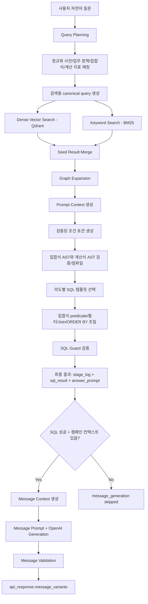

# 캠페인 RAG/GraphRAG 개발 보고서

## 1. 프로젝트 목적

이 프로젝트는 캠페인 추천과 NL2SQL 보조를 위해 자연어 질문을 구조화하고, 스키마/사전/SQL 예시/샘플 데이터를 RAG 검색 가능한 지식으로 변환하는 Python 기반 프로토타입이다.

핵심 목표는 다음과 같다.

1. 사용자의 자연어 질문에서 검색 조건을 추출한다.
2. 동의어와 한국어 표현을 canonical 값으로 정규화한다.
3. Qdrant 벡터 검색과 로컬 키워드 검색을 결합한다.
4. Knowledge Graph 관계를 따라 스키마, 비즈니스 용어, SQL 예시 문맥을 확장한다.
5. 업무 정책 기준을 별도 JSON 파일에서 관리하고 Query Plan/SQL 조건으로 반영한다.
6. 자연어 집합식을 `set_ast`로 구조화하고 합집합/교집합/차집합을 최종 SQL의 최적화된 predicate로 컴파일한다.
7. 명시적인 숫자 지표 계산식은 `formula_ast`로 구조화하고 검증된 SQL expression으로 컴파일한다.
8. LLM 또는 NL2SQL 단계에 전달할 prompt context를 생성한다.
9. 타겟팅 SQL 성공 이후 LMS/RCS 채널 메시지 3종을 생성하고 검증한다.
10. 생성된 타겟 오디언스와 메시지 3종을 A/B/C 실험, 사용자별 배정, webhook 이벤트, CTR 분석 API로 연결한다.
11. 화면에서는 `프롬프트 입력 -> 타겟팅 결과 -> 메시지 추천 -> 클릭 분석` 4단계 wizard로 노출한다.

## 2. 현재 산출물 요약

| 구분                     | 파일                                                                                       | 역할                                                                                                                     |
| ------------------------ | ------------------------------------------------------------------------------------------ | ------------------------------------------------------------------------------------------------------------------------ |
| 정규화 사전 인제스터     | `ingest.py`                                                                                | 동의어/부정 동의어를 canonical 값으로 변환                                                                               |
| 정규화 사전 벡터 인덱싱  | `qdrant_index.py`                                                                          | 사전 용어를 Qdrant 컬렉션에 적재                                                                                         |
| 캠페인/사용자 RAG 인덱싱 | `rag_index.py`                                                                             | 샘플 노드 전처리, 임베딩 생성, Qdrant 적재                                                                               |
| DDL 스키마 추출          | `schema_extract.py`                                                                        | PostgreSQL DDL에서 테이블/컬럼/키/인덱스 추출                                                                            |
| 업무 정책 정의           | `docs/data/business_policies.sample.json`                                                  | 매출 상위, 고매출, 고예산 같은 업무 기준과 SQL 반영 방식을 외부 파일로 정의                                              |
| 채널 메시지 정책/예시    | `docs/guides/channel.md`, `docs/policies/message-policy.json`, `docs/data/local_bootstrap.sql`         | LMS/RCS 메시지 생성 규칙과 기존 메시지 참고 테이블 정의                                                                  |
| 계산 지표 별칭           | `docs/data/metric_lexicon.sample.json`                                                     | 자연어 계산식의 지표명을 숫자형 스키마 컬럼으로 연결                                                                     |
| 계산식 엔진              | `formula_engine.py`                                                                        | 자연어/AST 계산식을 검증하고 안전한 SQL expression으로 컴파일                                                            |
| 집합식 엔진              | `set_expression_engine.py`                                                                 | 합집합/교집합/차집합 세그먼트 표현을 `set_ast`로 파싱                                                                    |
| RAG 지식 베이스 생성     | `build_rag_knowledge.py`                                                                   | 스키마, 사전, 비즈니스 용어, 업무 정책, SQL 예시를 지식 노드로 통합                                                      |
| GraphRAG 검색            | `graph_rag.py`                                                                             | 질의 계획 생성, 검색, 집합식 predicate 조립, SQL 템플릿 검증                                                             |
| 메시지 생성 프롬프트     | `docs/prompts/message_generation_*.txt`, `docs/prompts/message_generation_tone_manner.txt` | SQL 성공 이후 LMS/RCS 메시지 생성용 system/user/variant 및 톤앤매너 프롬프트                                             |
| SQL 안전 검증            | `sql_guard.py`                                                                             | SELECT/WITH SQL의 허용 범위, LIMIT, 민감 컬럼을 검증                                                                     |
| RAG 컬렉션 초기화        | `init_rag_collections.py`                                                                  | 캠페인/사용자 RAG와 지식 RAG 컬렉션을 한 번에 초기화                                                                     |
| RAG 컬렉션 상태 점검     | `check_rag_collections.py`                                                                 | Qdrant point count, vector size, payload 샘플을 검증                                                                     |
| 실행 환경                | `docker-compose.yml`                                                                       | Qdrant, PostgreSQL, Python 컨테이너 실행                                                                                 |
| Campaign API             | `api.py`                                                                                   | 타겟 SQL, 채널 메시지 생성, 타겟 오디언스 저장, 웹 버튼용 A/B/C 실험 시작 API, CTR 점수·배정·이벤트·분석 엔드포인트 제공 |
| 실패 로그 저장           | `campaign_query_failure_logs`, `api.py`                                                    | Query/SQL, DB 실행, 메시지 생성 실패를 운영 분석용으로 누적 저장                                                         |

## 3. 전체 처리 구조

운영자 화면은 아래 백엔드 흐름을 단계별로 나누어 보여준다.

| 화면 단계        | 백엔드 기준                                                                                |
| ---------------- | ------------------------------------------------------------------------------------------ |
| 1. 프롬프트 입력 | 자연어 프롬프트와 LMS/RCS 선택 채널을 `/target-sql` 입력으로 사용한다.                     |
| 2. 타겟팅 결과   | SQL guard를 통과한 read-only SQL 실행 결과와 저장된 타겟 오디언스를 보여준다.              |
| 3. 메시지 추천   | 타겟 컨텍스트와 캠페인 offer를 근거로 LMS/RCS 메시지 3종을 보여준다.                       |
| 4. 클릭 분석     | 메시지 3종을 A/B/C variant로 등록하고 배정/스킵, 분석 신뢰도, 이벤트 수집 상태를 보여준다. |



## 4. 데이터 구축 흐름

### 4.1 정규화 사전

- 입력: `docs/data/normalization_rules.sample.json`
- 처리: `ingest.py`, `qdrant_index.py`
- 출력 컬렉션: `campaign_normalization_terms`

정규화 사전은 한국어 표현, 영어 표현, 부정 동의어를 canonical 값으로 통합한다. 예를 들어 `여성`, `여자 고객`, `female`은 `female`로 변환된다.

### 4.2 캠페인/사용자 샘플 RAG 노드

- 입력: `docs/data/campaign_user_rag_sample_50_with_edges.json`
- 처리: `rag_index.py`
- 출력 컬렉션: `campaign_user_rag_nodes`

전처리에는 HTML 제거, Unicode 정규화, 특수문자 제거, 공백 정리, 중복 문장 제거가 포함된다. 추천 edge는 Qdrant payload에 함께 보존한다.

### 4.3 스키마/정책/SQL 지식 베이스

- 입력: `docs/data/local_bootstrap.sql`, `docs/data/schema_catalog.json`, `docs/data/business_policies.sample.json`, `docs/data/metric_lexicon.sample.json`, `docs/data/sql_examples.sample.sql`
- 처리: `schema_extract.py`, `build_rag_knowledge.py`
- 출력: `docs/data/rag_knowledge_base.json`
- 출력 컬렉션: `campaign_knowledge_rag`

`business_policies.sample.json`은 `매출이 가장 높은`, `고매출`, `예산이 큰`처럼 코드에 하드코딩하면 운영 기준이 흐려지는 표현을 별도 정책으로 정의한다. 순위형 정책은 `sql_behavior=rank`로 ORDER BY를 만들고, 기준 금액이 필요한 정책은 `sql_behavior=filter`, `threshold_krw` 값으로 WHERE 조건을 만든다. `threshold_krw`가 `null`이면 GraphRAG는 임의 기준을 만들지 않고 기준 금액을 정책 파일에 정의하라는 clarification을 반환한다.

같은 파일에는 `channel_message_generation` 정책도 포함한다. 이 정책은 메시지 생성 기본 채널을 `lms`로 두고, 허용 채널을 `lms`, `rcs`로 제한하며, 채널별 글자 수와 필수 variant(`benefit_emphasis`, `urgency_emphasis`, `emotion_emphasis`)를 정의한다. 메시지 생성은 `campaigns.offer`와 기존 메시지 예시를 벗어나는 혜택을 만들지 않는 것을 기본 정책으로 삼는다.

`docs/data/local_bootstrap.sql`에는 메시지 생성과 성과 분석을 위한 `campaign_message_examples`, `campaign_channel_messages`, `campaign_experiments`, `campaign_message_variants`, `campaign_message_deliveries`, `campaign_message_events` 테이블이 있다. 기존 문안과 브랜드 톤은 `campaign_message_examples`에서 가져오고, 실제 발송 이력과 A/B/C 실험 결과는 delivery/event 로그와 `v_campaign_variant_metrics`, `v_campaign_segment_metrics`, `v_campaign_daily_metrics` view에서 집계한다.

`api.py`는 이 스키마 위에 `/campaign-experiments`, `/ai/ctr/score`, `/campaign-experiments/{experiment_id}/assignments`, `/webhooks/message-events/{provider}`, `/ai/ctr/analyze`를 제공한다. `/api/...` prefix 경로도 함께 열려 있어 외부 연동 문서의 경로와 기존 로컬 테스트 경로를 모두 사용할 수 있다. 현재 CTR scoring은 실제 ML 모델이 아니라 `heuristic-ctr-v1` baseline이며, 분석 리포트는 LLM 없이 SQL view 집계값으로 생성한다.

같은 파일은 `지역`처럼 의미가 모호한 표현도 `sql_behavior=disambiguation` 정책으로 관리한다. 예를 들어 `TV를 구매한 사람의 지역`은 기본적으로 고객 거주 지역 `users.region`으로 해석한다. 반대로 `TV를 구매한 곳의 지역`, `구매 장소`, `매장 지역`, `배송지`처럼 구매 발생 위치를 뜻하는 표현이 들어오면 현재 스키마에 구매 발생 지역 컬럼이 없으므로 SQL을 만들지 않고 clarification을 반환한다.

사용자가 `(여성 고객 + VIP 고객) * 쿠폰 관심 고객 - 휴면 고객`처럼 세그먼트 집합식을 쓰면 `set_expression_engine.py`가 이를 `set_ast`로 파싱한다. `+`는 합집합, `*`는 교집합, `-`는 차집합으로 해석하며, 자연어 표현인 `또는`, `그리고`, `제외`, `빼고`도 같은 연산으로 정규화한다. GraphRAG는 집합식에 포함된 canonical 조건을 일반 AND 조건으로 중복 적용하지 않고, `set_ast` 전체를 최종 SQL의 단일 predicate로 컴파일한다. 최종 SQL에서는 합집합을 `OR`, 교집합을 `AND`, 차집합을 `AND NOT`으로 낮추고, 관심사/행동/채널처럼 별도 테이블이 필요한 피연산자는 `EXISTS` semijoin으로 표현한다.

`metric_lexicon.sample.json`은 `평균주문금액`, `구매횟수`, `예산` 같은 자연어 지표명을 숫자형 스키마 컬럼으로 연결한다. 사용자가 `(평균주문금액 + 구매횟수) * 구매횟수 - 최근활동일`처럼 명시적인 숫자 지표 계산식을 쓰면 `formula_engine.py`가 이를 `formula_ast`로 파싱하고, 스키마에 있는 숫자형 컬럼과 허용 연산자만 사용했는지 검증한 뒤 SQL expression으로 컴파일한다. LLM parser를 쓰더라도 SQL 문자열을 직접 받지 않고 `set_ast` 또는 `formula_ast`만 받아 같은 검증 경로를 통과시킨다.

지식 베이스는 다음 노드 타입을 가진다.

| 노드 타입            | 설명                                                  |
| -------------------- | ----------------------------------------------------- |
| `schema_table`       | 테이블 구조와 주요 컬럼 설명                          |
| `schema_column`      | GraphRAG 실행 시 테이블 컬럼에서 생성되는 그래프 노드 |
| `normalization_rule` | canonical 용어와 동의어 사전                          |
| `business_term`      | 캠페인, 사용자, 추천 등 도메인 용어                   |
| `business_policy`    | 업무 기준과 SQL filter/rank 반영 방식                 |
| `metric_alias`       | 자연어 계산 지표명과 숫자형 스키마 컬럼 매핑          |
| `sql_example`        | NL2SQL 참고용 대표 SQL 예시                           |

### 4.4 Qdrant 컬렉션 상태 점검

- 입력: `docs/data/campaign_user_rag_sample_50_with_edges.json`, `docs/data/rag_knowledge_base.json`
- 처리: `check_rag_collections.py`
- 점검 컬렉션: `campaign_user_rag_nodes`, `campaign_knowledge_rag`

색인 후에는 다음 명령으로 실제 Qdrant 상태를 확인한다.

```bash
docker compose run --rm python python check_rag_collections.py --strict
```

점검 항목은 다음과 같다.

| 항목             | 설명                                                                       |
| ---------------- | -------------------------------------------------------------------------- |
| 컬렉션 존재 여부 | Qdrant에 대상 컬렉션이 생성되어 있는지 확인한다.                           |
| point count      | 입력 JSON의 노드 수와 Qdrant point 수가 같은지 비교한다.                   |
| vector config    | vector size와 distance를 확인한다.                                         |
| payload 샘플     | `node_id`, `node_type`, `text`, `source` 필드가 payload에 있는지 확인한다. |

`--strict`를 사용하면 점검 실패 시 종료 코드 1을 반환하므로 자동화된 로컬 점검이나 CI에 사용할 수 있다.

## 5. 질의 처리 상세

### 5.1 Query Planning

`graph_rag.py`는 검색 전에 자연어 질문을 다음 구조로 변환한다.

```json
{
  "intent": "recommend_campaign",
  "target_user": {
    "gender": "female",
    "age_min": 20,
    "age_max": 29,
    "lifecycle": [],
    "interests": [],
    "preferred_channels": [],
    "behaviors": ["cart_abandoner"],
    "price_sensitivity": null
  },
  "exclude": {
    "gender": [],
    "interests": [],
    "lifecycle": []
  },
  "campaign_constraints": {
    "category": [],
    "objective": null,
    "offer_type": "coupon",
    "channels": []
  },
  "policy_constraints": [],
  "semantic_resolutions": [],
  "computed_metrics": [],
  "set_expressions": [],
  "retrieval": {
    "query": "20대 female cart_abandoner에게 coupon 캠페인 추천",
    "terms": ["female", "cart_abandoner", "coupon"]
  }
}
```

현재 구현은 로컬 정규화 사전과 규칙 기반 age/intent/objective 추출을 기본 parser로 사용한다. 추가로 `--query-parser auto` 또는 `--query-parser llm`을 지정하면 OpenAI 기반 LLM Query Parser를 먼저 시도하고, `OPENAI_API_KEY`가 없거나 응답 검증에 실패하면 같은 JSON 구조의 규칙 기반 parser로 fallback한다.

LMS/RCS 메시지 요청은 정규화 사전에서 각각 `lms`, `rcs` canonical 값으로 변환된다. 이 값은 `target_user.preferred_channels`와 `campaign_constraints.channels`에 들어가며, SQL에서는 `user_preferred_channels`와 `campaign_channels` 조건으로 반영된다. 메시지 생성 단계는 `--message-channel auto|lms|rcs` 옵션을 기준으로 최종 발송 채널을 확정한다.

업무 정책 매칭은 기본적으로 `docs/data/business_policies.sample.json`을 읽는다. 다른 정책 파일을 사용하려면 `graph_rag.py` 실행 시 `--business-policies`를 지정한다. 예를 들어 `매출이 가장 높은 고객`은 `top_revenue_user` 정책으로 매칭되어 추정 매출 기준 ORDER BY를 만들고, `매출이 높은 고객`은 `high_revenue_user` 정책의 `threshold_krw`가 채워져 있을 때만 WHERE 조건을 만든다.

의미 해석 정책도 같은 파일에서 읽는다. `지역` 표현은 `region_context_default` 정책으로 매칭되어 Query Plan의 `semantic_resolutions`에 기록된다. 기본 해석은 `users.region`이며, 구매 장소나 배송지처럼 대체 의미가 명시됐지만 스키마 컬럼이 없으면 `query_plan_required_conditions_missing`으로 clarification을 반환한다.

복합 집합식은 `set_expressions`에 기록된다. 규칙 기반 parser는 `여성 고객과 VIP 고객의 합집합`, `(여성 고객 + VIP 고객) * 쿠폰 관심 고객 - 휴면 고객`, `쿠폰 관심 고객에서 휴면 고객 제외`, `20대 여성 고객 또는 VIP 고객을 대상으로 하되 쿠폰 관심 고객만 포함하고 휴면 고객은 빼고 찾아줘` 같은 표현을 `set_ast`로 변환한다. `set_expression_engine.py`는 정규화 사전의 canonical 피연산자만 사용하고, GraphRAG는 AST의 집합 의미를 보존한 채 최종 SQL에서는 중간 CTE 체인 없이 `OR`/`AND`/`AND NOT` 및 `EXISTS` predicate로 컴파일한다.

숫자 지표 계산식은 `computed_metrics`에 기록된다. 규칙 기반 parser는 `평균주문금액과 구매횟수를 곱한 값`, `(평균주문금액 + 구매횟수) * 구매횟수 - 최근활동일` 같은 명시적 계산식을 `formula_ast`로 변환한다. `formula_engine.py`는 숫자형 컬럼, 허용 연산자, intent별 테이블 범위를 검증하고, 통과한 계산식만 SELECT/WHERE/ORDER BY 토큰으로 변환한다.

LLM Query Parser, 답변 생성, 메시지 생성 프롬프트는 `docs/prompts`의 텍스트 파일에서 읽는다. 운영 중 프롬프트를 조정해야 하면 코드를 수정하지 않고 `docs/prompts/query_plan_system.txt`, `docs/prompts/query_plan_user.txt`, `docs/prompts/answer_system.txt`, `docs/prompts/answer_user.txt`, `docs/prompts/message_generation_*.txt`, `docs/prompts/message_generation_tone_manner.txt`를 수정한 뒤 같은 질의를 다시 실행한다. 다른 프롬프트 디렉터리를 사용하려면 `GRAPH_RAG_PROMPT_DIR` 환경 변수나 `--prompt-dir` 옵션을 지정한다. 상세 가이드는 `docs/guides/prompt_engineering.md`에 정리한다.

LLM Query Parser는 다음 원칙을 따른다.

- 반환 구조는 기존 Query Plan JSON과 동일하다.
- canonical 값은 정규화 사전과 코드의 허용 값 집합 안에서만 반영한다.
- `남성이 아닌` 같은 부정 조건은 `target_user.gender=female`로 치환하지 않고 `exclude.gender=male`로 유지한다.
- LLM 응답이 비어 있거나 허용되지 않은 값을 포함하면 기존 규칙 기반 결과를 보존한다.

### 5.2 Hybrid Retrieval

1. Dense Search: Qdrant에서 임베딩 유사도 기반 seed node를 찾는다.
2. Keyword Search: 로컬 knowledge graph payload를 BM25로 점수화해 seed node를 보강한다.
3. Merge / Score Sort: 동일 node id는 가장 높은 score만 유지하고 점수순으로 정렬한다.
4. Graph Expansion: seed node에서 지정 hop 수만큼 이웃 노드를 확장한다.
5. Context Assembly: 확장된 노드를 Top-K chunk, graph context, metadata, prompt context로 조립한다.
6. Condition Token Builder: Query Plan에서 검증된 조건 토큰을 생성한다.
7. Expression Compile: `set_expressions`의 `set_ast`는 최적화된 WHERE predicate로, `computed_metrics`의 `formula_ast`는 안전한 SQL expression으로 컴파일한다.
8. SQL Template Assembly: intent별 기본 SQL 템플릿에 필요한 집합식 predicate, JOIN, WHERE 필터, 정책/계산식 기반 ORDER BY를 조립한다.
9. SQL Guard: 조립된 SQL을 `sql_guard.py`로 안전 검증한다.
10. Message Generation: SQL이 성공하고 캠페인 컨텍스트가 있으면 LMS/RCS 메시지 생성 컨텍스트와 프롬프트를 만든다. 캠페인 offer는 선택값이며, 없으면 혜택 표현을 만들지 않는다.
11. Stage Log: 각 단계의 입력/출력 개수와 처리 요약을 `stage_log`에 남긴다.

## 6. 검색 결과 통합과 Context Assembly

현재 구현은 별도 reranker 모델을 사용하지 않는다. 벡터 검색과 BM25 키워드 검색 결과를 병합한 뒤, 같은 node id는 가장 높은 score만 남기고 score 기준으로 정렬한다.

`graph_rag.py`의 `assemble_context()`는 그래프 확장 결과를 다음 구조로 조립한다.

| 필드            | 설명                                       |
| --------------- | ------------------------------------------ |
| `top_k_chunks`  | LLM에 직접 전달할 수 있는 순위별 지식 조각 |
| `graph_context` | seed와 이웃 노드, relation, 확장 reason    |
| `metadata`      | context 노드 수와 타입 분포                |
| `prompt`        | LLM/NL2SQL 단계에 넘길 텍스트 context      |

`render_answer_prompt()`는 사용자 질문, query plan, assembled context를 하나의 답변 생성 프롬프트로 묶는다. 기본 실행은 prompt와 구조화 응답만 만들고, `--generate-answer`를 지정하면 OpenAI Chat Completion으로 최종 답변 생성을 시도한다. API 키가 없거나 호출에 실패해도 `api_response`는 검증된 SQL 상태를 기준으로 반환된다.

답변 생성 system/user 프롬프트도 `docs/prompts`에서 로드한다. 기본 템플릿에는 Query Plan, 검색 Context, SQL Result, SQL 사용 정책이 포함되며, SQL Result가 실패 상태이면 LLM이 새 SQL을 만들거나 후보 SQL을 수정하지 못하게 제한한다.

최종 GraphRAG 결과에는 다음 필드가 추가로 포함된다.

| 필드                            | 설명                                                                                                                                                                                                      |
| ------------------------------- | --------------------------------------------------------------------------------------------------------------------------------------------------------------------------------------------------------- |
| `stage_log`                     | Query Planning부터 SQL Guard까지 단계별 요약 로그                                                                                                                                                         |
| `sql_result.sql`                | SQL guard와 Query Plan 조건 커버리지를 모두 통과한 최종 SQL                                                                                                                                               |
| `sql_result.condition_tokens`   | Query Plan에서 검증한 조건 토큰과 각 토큰의 SQL clause/predicate, join, select column, order by 요구사항                                                                                                  |
| `sql_result.selected`           | 선택된 SQL 템플릿, source, validation, coverage 결과                                                                                                                                                      |
| `sql_result.candidates`         | 템플릿 조립 SQL 후보와 SQL guard 및 조건 커버리지 결과                                                                                                                                                    |
| `sql_result.is_success`         | 최종 SQL 선택 성공 여부                                                                                                                                                                                   |
| `sql_result.failure_reason`     | 실패 사유. `query_plan_required_conditions_missing`, `query_plan_conditions_missing`, `query_plan_unmentioned_conditions_added`, `sql_guard_failed`, `intent_scope_mismatch`, `no_sql_candidates` 중 하나 |
| `answer_prompt`                 | 사용자 질문, query plan, context, SQL result를 포함한 후속 LLM 입력                                                                                                                                       |
| `answer`                        | `--generate-answer` 사용 시 LLM 답변 생성 결과와 실패 사유                                                                                                                                                |
| `message_generation_prompt`     | LMS/RCS 메시지 생성을 위해 OpenAI에 전달할 user prompt                                                                                                                                                    |
| `message_generation`            | 메시지 생성 모드, 생성 결과, 검증 결과, 실패 사유                                                                                                                                                         |
| `api_response.message_variants` | API가 사용할 LMS/RCS 발송 문안 3종                                                                                                                                                                        |
| `api_response`                  | 추천 API 응답으로 바로 사용할 수 있는 status, message, sql, 질문 목록 요약                                                                                                                                |

## 7. SQL 안전 검증

NL2SQL 단계에서 생성된 SQL은 `sql_guard.py`로 검증한다. 현재 구현된 정책은 다음과 같다.

- SELECT 또는 WITH로 시작하는 read-only SELECT만 허용
- DROP/DELETE/UPDATE/INSERT 금지
- 허용 테이블만 접근. 단, `WITH` 절에서 정의한 CTE 이름은 실제 테이블 allowlist 검사에서 제외
- LIMIT 기본값 강제
- 개인정보성 컬럼 감지와 마스킹 SQL 제안
- WHERE 없는 대량 조회 제한

실행 예시:

```bash
docker compose run --rm python python sql_guard.py "SELECT user_id, name FROM users"
```

검증 결과는 `is_valid`, `safe_sql`, `masked_sql`, `tables`, `sensitive_columns`, `issues`를 포함하는 JSON으로 반환된다.

### 7.1 조건 토큰과 SQL 템플릿 조립

최종 SQL은 더 이상 `sql_example` 노드를 그대로 선택하지 않는다. 처리 순서는 다음과 같다.

1. 자연어를 Query Plan으로 변환한다.
2. Query Plan의 canonical 값만 검증된 조건 토큰으로 만든다.
3. intent에 맞는 기본 SQL 템플릿을 선택한다.
4. 조건 토큰이 요구하는 집합식 predicate, JOIN, WHERE clause, 정책 기반 ORDER BY만 조립한다.
5. 조립된 SQL을 SQL guard와 Query Plan coverage로 검증한다.

업무 정책 조건은 `policy_constraints`에서 생성된다. `sql_behavior=rank`인 정책은 SELECT에 metric 표현식을 추가하고 ORDER BY를 붙인다. `sql_behavior=filter`인 정책은 `threshold_krw`가 숫자로 정의되어 있을 때만 WHERE 조건을 만든다. 기준값이 `null`이면 SQL을 만들지 않고 `query_plan_required_conditions_missing`과 함께 정책 기준 금액을 정의하라는 질문을 반환한다.

모호한 의미 해석은 `semantic_resolutions`에서 생성된다. `region_context_default`처럼 기본 컬럼이 있는 정책은 SELECT 컬럼을 보강한다. 단, 사용자가 구매 장소/매장/배송지 지역을 명시했는데 해당 컬럼이 스키마에 없으면 SQL 생성을 멈추고 clarification을 반환한다.

세그먼트 집합식은 `set_expressions`에서 생성된다. 집합식 안에 포함된 피연산자는 기존 `target_user`의 일반 AND 조건으로 다시 넣지 않고, `set_ast` 전체에서 하나의 검증된 predicate를 만든다. 합집합은 `OR`, 교집합은 `AND`, 차집합은 `AND NOT`으로 컴파일하며, 다대다 테이블이 필요한 조건은 `EXISTS` semijoin으로 표현한다. 조건 토큰에는 `segment_predicate`가 들어가고, `assemble_sql_from_template()`는 이를 최종 WHERE clause에 배치한다.

`sql_example` 노드는 검색 context와 대표 패턴 설명에는 계속 사용하지만, 최종 SQL의 source는 `sql_template:recommend_campaign` 또는 `sql_template:find_user_segment` 같은 의도별 템플릿이다.

SQL을 조립하기 전에 사용자 입력 자체가 SQL 생성을 위한 최소 조건을 포함하는지 먼저 검사한다. 캠페인 추천 intent인데 추천 기준이 되는 고객 조건이나 캠페인 조건이 하나도 없으면 SQL 템플릿 조립과 SQL guard 검증을 진행하지 않고 추가 조건을 질문한다.

반대로 `쿠폰 캠페인 추천`, `쿠폰 관심 고객 맞춤 쿠폰 캠페인 추천`처럼 사용자 입력에 명시 조건이 있으면 그 조건 토큰만으로 SQL을 조립한다. 성별, 연령대, 행동 조건, 타겟 세그먼트 조건은 항상 필수인 것이 아니라 사용자가 명시했거나 그 조건에서 파생되는 경우에만 WHERE clause로 들어간다.

추천 기준이 하나도 없으면 다음처럼 처리한다.

- `sql_result.sql`: `null`
- `sql_result.is_success`: `false`
- `sql_result.failure_reason`: `query_plan_required_conditions_missing`
- `api_response.status`: `needs_clarification`
- `api_response.clarification_questions`: 추천 기준 조건을 확인하는 질문 목록

또한 SQL 후보가 사용자 입력에 명시되지 않은 성별, 연령대, 행동 조건, 타겟 세그먼트 조건을 WHERE 절에 추가하면 `query_plan_unmentioned_conditions_added`로 실패 처리한다. 즉 검색 context나 SQL 예시에서 조건을 가져와 임의로 덧붙이지 않는다.

예를 들어 Query Plan에 다음 조건이 있으면 조건 토큰은 모두 SQL에 반영되어야 한다.

- `target_user.gender = female`
- `target_user.age_min = 20`
- `target_user.age_max = 29`
- `target_user.behaviors = cart_abandoner`
- `campaign_constraints.target_segment = cart_abandoner`
- `campaign_constraints.offer_type = coupon`

조립 SQL이 `cart_abandoner` 조건만 포함하고 `female`, `20대`, `coupon` 조건을 빠뜨리면 다음처럼 처리한다.

- `sql_result.sql`: `null`
- `sql_result.is_success`: `false`
- `sql_result.failure_reason`: `query_plan_conditions_missing`
- `sql_result.selected.coverage.missing_conditions`: 누락된 Query Plan 조건 목록

조건 커버리지를 통과한 SQL만 최종 SQL로 반환한다. 민감 컬럼이 있으면 `masked_sql`, 없으면 `safe_sql`이 `sql_result.sql`에 들어간다.

예를 들어 `20대 여성 장바구니 이탈 고객에게 쿠폰 캠페인 추천`은 다음 조건 토큰을 만들고, `recommend_campaign` 템플릿에 필요한 JOIN과 WHERE를 조립한다.

- `u.gender = 'female'`
- `u.age BETWEEN 20 AND 29`
- `urb.behavior LIKE 'cart_abandoned:%'`
- `ck.keyword = '쿠폰'`
- `ts.target_segment = 'cart_abandoner'`

`20~30대 남성이 아닌 장바구니 이탈 고객에게 쿠폰 캠페인 추천`처럼 부정 조건과 캠페인 추천 조건이 함께 있는 질문은 다음 조건 토큰으로 조립한다.

- `u.gender <> 'male'`
- `u.age BETWEEN 20 AND 39`
- `urb.behavior LIKE 'cart_abandoned:%'`
- `ck.keyword = '쿠폰'`
- `ts.target_segment = 'cart_abandoner'`

`쿠폰 관심 고객 맞춤 쿠폰 캠페인 추천`은 `쿠폰 관심 고객`을 `price_sensitive` 고객 조건으로 정규화하고, `쿠폰 캠페인`을 `offer_type=coupon` 캠페인 조건으로 처리한다. 이 경우 다음 조건 토큰으로 SQL을 조립한다.

- `u.price_sensitivity = 'high'`
- `ts.target_segment = 'price_sensitive'`
- `ck.keyword = '쿠폰'`

부정 조건은 긍정 조건으로 임의 치환하지 않는다. 예를 들어 `20~30대 남성이 아닌 사용자`는 `20대 여성 사용자`가 아니라 다음 Query Plan 조건으로 처리한다.

- `target_user.age_min = 20`
- `target_user.age_max = 39`
- `exclude.gender = male`

따라서 `u.gender = 'female'`인 SQL은 이 요청을 완전히 만족한 것으로 보지 않는다. SQL 후보는 `u.gender <> 'male'`, `u.gender != 'male'`, `NOT u.gender = 'male'`처럼 남성을 제외하는 조건을 명시해야 한다. 현재 검색된 후보가 `20대 여성` 대상 SQL뿐이면 coverage 실패로 처리한다.

이 경우 최종 결과는 다음처럼 유지한다.

- `sql_result.sql`: `null`
- `sql_result.is_success`: `false`
- `sql_result.failure_reason`: `query_plan_conditions_missing`
- 후속 Answer Generation은 새 SQL을 생성하거나 기존 SQL을 수정하지 않고, 현재 조건을 완전히 만족하는 검증된 SQL이 없다고 답변한다.

단, 사용자 intent가 `find_user_segment`인 단순 사용자 조회라면 캠페인 조인 SQL을 최종 SQL로 선택하지 않는다. 예를 들어 `20~30대 남성이 아닌 사용자` 질의가 캠페인 추천 조건을 포함하지 않으면 `campaigns`, `campaign_keywords`, `campaign_target_segments`를 사용하는 추천 SQL은 `intent_scope_mismatch`로 제외한다.

## 8. LMS/RCS Message Generation 연동 방식

`graph_rag.py`는 SQL 생성이 성공한 뒤 `message_generation_prompt`와 `message_generation`을 만들 수 있다. 기본값은 LLM 호출 없이 prompt와 message context만 만드는 모드이며, `--generate-messages`를 지정하면 OpenAI Chat Completion으로 실제 메시지 생성을 시도한다.

Message Generation 단계의 계약은 다음과 같다.

1. `sql_result.is_success=true`일 때만 실행한다.
2. 메시지 채널은 `lms`, `rcs`만 허용한다.
3. `--message-channel auto`이면 Query Plan에 있는 LMS/RCS 값을 우선 사용하고, 없으면 정책 기본값 `lms`를 사용한다.
4. 캠페인 컨텍스트는 Query Plan의 채널과 타겟 세그먼트에 맞는 campaign payload를 사용한다. 혜택 조건은 campaign offer나 keyword 근거가 있을 때만 필터로 적용한다.
5. `campaigns.offer` 또는 기존 메시지 예시에서 확인되지 않은 혜택, 할인율, 무료 제공, 기간은 만들지 않는다.
6. 생성 결과는 `benefit_emphasis`, `urgency_emphasis`, `emotion_emphasis` 3개 variant만 허용한다.
7. 각 메시지는 요청 채널, source campaign id, 선택값인 used offer, 글자 수 제한을 검증한다. Message Context의 캠페인이 1개뿐이고 `source_campaign_id`가 비어 있으면 해당 캠페인 ID로 보정한다.
8. 세 variant는 병렬 OpenAI 호출로 생성하며 전체 attempt 시간은 가장 늦게 끝난 variant 호출에 맞춰진다.
9. OpenAI variant 호출 timeout은 `MESSAGE_GENERATION_OPENAI_TIMEOUT_SECONDS`로 조절한다. 기본값은 15초다.
10. `/channel-messages` API 로그의 `api_timing.database_message_refresh.message_generation_timing`에서 attempt별 시간과 variant별 호출 시간을 확인한다.
11. 기본 `campaign_knowledge_rag` 컬렉션은 스키마/정책/용어 중심이므로 캠페인 offer payload가 없을 수 있다. 이 경우 메시지 생성은 계속 진행하되 확인되지 않은 혜택 표현과 `used_offer`는 만들지 않는다.
12. 캠페인 offer 기반 메시지까지 확인하려면 `--data docs/data/campaign_user_rag_sample_50_with_edges.json --collection campaign_user_rag_nodes`를 함께 지정한다.

실행 예시:

```bash
docker compose run --rm python python graph_rag.py "장바구니 이탈 여성 고객에게 쿠폰 캠페인 추천하고 RCS 메시지까지 만들어줘" --format json --data docs/data/campaign_user_rag_sample_50_with_edges.json --collection campaign_user_rag_nodes --vector-top-k 0 --keyword-top-k 5 --graph-top-k 5 --query-parser auto --generate-messages --message-channel rcs
```

OpenAI 호출 없이 프롬프트만 확인하려면 `--generate-messages`를 빼고 실행한다.

## 9. 클릭률 분석 연동 방식

클릭률 분석은 메시지 생성 3종을 A/B/C 실험으로 승격한 뒤, 배정 데이터와 이벤트 데이터를 분리해 처리한다. 상세 프로세스와 화면 기준은 `docs/guides/ctr_analysis_process.md`를 기준으로 한다.

핵심 계약은 다음과 같다.

1. `/campaign-experiments/run`은 `campaignId + experimentName`으로 기존 실험을 재사용한다.
2. 기존 사용자 배정은 새로 insert하지 않고 `assignments[].isReused=true`, `reusedAssignmentCount`로 응답한다.
3. `createdAssignmentCount=0`이어도 `reusedAssignmentCount>0`이면 발송 후보가 있는 상태다.
4. 이벤트가 없으면 `analysis.analysisBasis=predicted_assignment`, `analysis.primaryMetricUsed=avg_predicted_click_probability`로 예측 기반 임시 후보를 반환한다.
5. 이벤트가 쌓이면 `v_campaign_variant_metrics` 기반 관측 지표로 `analysis.analysisBasis=observed_events` 분석을 반환한다.
6. LMS/SMS/Kakao는 impression 이벤트가 불안정할 수 있어 `delivered_ctr_pct`를 우선 사용하고, RCS는 `ctr_pct`를 우선 사용한다.
7. `ai_features`는 메시지 분석 보조 근거이며, `무료 수신거부` 같은 법정 고지는 CTA나 가격 혜택으로 보지 않는다.

## 10. LLM #2 Answer Generation 연동 방식

`graph_rag.py`는 `answer_prompt`와 검증된 `sql_result`를 생성한다. 기본값은 LLM 호출 없이 `api_response`를 반환하는 모드이며, `--generate-answer`를 지정하면 `answer_prompt`를 OpenAI Chat Completion에 전달해 최종 답변 생성을 시도한다.

Answer Generation 단계의 계약은 다음과 같다.

1. `query_plan`의 intent와 조건을 우선 근거로 사용한다.
2. `context_assembly.prompt`에 포함된 지식만 근거로 답변한다.
3. SQL은 SQL guard와 Query Plan 조건 커버리지를 모두 통과한 `sql_result.sql`만 사용자에게 반환한다.
4. `sql_result.is_success=false`이면 새 SQL을 생성하거나 후보 SQL을 수정하지 않는다.
5. 근거가 부족하면 임의로 SQL이나 추천 사유를 만들지 않는다.
6. `sql_result.failure_reason=query_plan_required_conditions_missing`이면 SQL을 만들지 않고 `clarification_questions`를 사용자에게 질문한다.
7. LLM 호출이 비활성화되었거나 실패하면 `api_response.message`는 검증 상태 기반의 기본 메시지를 반환한다.

## 11. 실행 방법

모든 Docker Compose 명령은 `docker-compose.yml`이 있는 프로젝트 루트에서 실행한다.

```powershell
Set-Location C:\PROJECT\sample
```

프로젝트 루트로 이동하지 않고 실행해야 한다면 `-f C:\PROJECT\sample\docker-compose.yml --project-directory C:\PROJECT\sample`을 함께 지정한다.

Python 컨테이너는 `docker-compose.yml`의 `env_file: .env` 설정을 통해 `.env`를 읽는다. OpenAI 기능을 쓰려면 `.env`에 다음 값을 둔다.

```env
OPENAI_API_KEY=발급받은_키
OPENAI_MODEL=gpt-4o-mini
MESSAGE_GENERATION_OPENAI_TIMEOUT_SECONDS=15
```

키 값은 출력하지 말고 로드 여부만 확인한다.

```bash
docker compose exec python python -c "import os; print('OPENAI_API_KEY loaded=' + str(bool(os.getenv('OPENAI_API_KEY'))))"
```

### 11.1 인프라 실행

```bash
docker compose up -d qdrant postgres python
```

Python 컨테이너는 계속 실행 상태로 유지되므로 이후 명령은 `docker compose exec python ...`으로 실행한다.

### 11.2 스키마 카탈로그 재생성

```bash
docker compose exec python python schema_extract.py docs/data/local_bootstrap.sql --output docs/data/schema_catalog.json
```

### 11.3 지식 베이스 재생성

```bash
docker compose exec python python build_rag_knowledge.py
```

### 11.4 캠페인/사용자 RAG 노드 적재

```bash
docker compose exec python python rag_index.py docs/data/campaign_user_rag_sample_50_with_edges.json --recreate
```

두 RAG 컬렉션을 한 번에 초기화하려면 다음 운영 스크립트를 사용한다. 기본적으로 지식 베이스 JSON을 재생성한 뒤 캠페인/사용자 컬렉션과 지식 컬렉션을 순서대로 인덱싱한다.

```bash
docker compose exec python python init_rag_collections.py --recreate
```

인프라 실행, 두 RAG 컬렉션 재생성, 검색 확인까지 한 번에 수동으로 실행하려면 PowerShell에서 다음 명령을 사용한다.

```powershell
docker compose up -d qdrant postgres python; docker compose exec python python init_rag_collections.py --recreate; docker compose exec python python graph_rag.py "20대 여성 장바구니 이탈 고객에게 쿠폰 캠페인 추천" --format text
```

임베딩이나 Qdrant 쓰기 없이 입력 JSON만 검증하려면 다음 명령을 사용한다.

```bash
docker compose exec python python init_rag_collections.py --validate-only --skip-knowledge-build
```

### 11.5 스키마/사전/SQL 지식 노드 적재

```bash
docker compose exec python python rag_index.py docs/data/rag_knowledge_base.json --collection campaign_knowledge_rag --recreate
```

### 11.6 GraphRAG 검색 실행

```bash
docker compose exec python python graph_rag.py "20대 여성 장바구니 이탈 고객에게 쿠폰 캠페인 추천" --format text
```

text 출력은 `STAGE LOG`, `QUERY PLAN`, `SQL RESULT`, 검색 결과, graph context, prompt context 순서로 보여준다.

Qdrant 컬렉션 없이 BM25/Graph/SQL 결과만 확인하려면 vector 검색을 끄고 실행한다.

```bash
docker compose exec python python graph_rag.py "20대 여성 장바구니 이탈 고객에게 쿠폰 캠페인 추천" --vector-top-k 0 --format text
```

JSON으로 `stage_log`, `query_plan`, `context_assembly`, `sql_result`, `answer_prompt`까지 확인하려면 다음 명령을 사용한다.

```bash
docker compose exec python python graph_rag.py "20대 여성 장바구니 이탈 고객에게 쿠폰 캠페인 추천" --format json
```

LLM Query Parser를 선택적으로 사용하려면 다음처럼 실행한다. `OPENAI_API_KEY`가 없으면 규칙 기반 parser로 fallback하고, fallback 여부는 `query_plan.parser`에 기록된다.

```bash
docker compose exec python python graph_rag.py "20~30대 남성이 아닌 사용자" --query-parser auto --vector-top-k 0 --format json
```

후속 Answer Generation까지 호출하려면 `OPENAI_API_KEY`를 설정한 뒤 `--generate-answer`를 추가한다. 실패하거나 비활성화된 경우에도 `api_response`는 검증 SQL 여부를 기준으로 반환된다.

```bash
docker compose exec python python graph_rag.py "20대 여성 장바구니 이탈 고객에게 쿠폰 캠페인 추천" --generate-answer --format json
```

SQL 이후 LMS/RCS 메시지까지 생성하려면 `--generate-messages`와 `--message-channel`을 추가한다. 캠페인 payload가 필요하므로 샘플 캠페인/사용자 데이터와 컬렉션을 명시한다.

```bash
docker compose exec python python graph_rag.py "장바구니 이탈 여성 고객에게 쿠폰 캠페인 추천하고 RCS 메시지까지 만들어줘" --format json --data docs/data/campaign_user_rag_sample_50_with_edges.json --collection campaign_user_rag_nodes --vector-top-k 0 --keyword-top-k 5 --graph-top-k 5 --query-parser auto --generate-messages --message-channel rcs
```

그래프 통계만 확인하려면 다음 명령을 사용한다.

```bash
docker compose exec python python graph_rag.py --stats
```

### 11.7 생성 SQL 안전 검증

```bash
docker compose exec python python sql_guard.py "SELECT user_id, name FROM users"
```

## 12. 현재 검증 결과

`graph_rag.py --stats` 기준 현재 knowledge graph는 다음 규모다.

| 항목               |  값 |
| ------------------ | --: |
| 전체 노드          | 264 |
| 전체 엣지          | 480 |
| 비즈니스 용어 노드 |  20 |
| 업무 정책 노드     |   5 |
| 계산 지표 노드     |   6 |
| 정규화 규칙 노드   |  40 |
| 스키마 테이블 노드 |  18 |
| 스키마 컬럼 노드   | 157 |
| SQL 예시 노드      |  18 |

추가로 다음 검증을 수행했다.

- `graph_rag.py` Python syntax compile 통과
- `graph_rag.py --stats` 실행 통과
- `build_query_plan()` 정규화 사전 기반 조건 추출 통과
- `keyword_search()` BM25 기반 검색 smoke test 통과
- `assemble_context()` context assembly smoke test 통과
- `sql_guard.py` SQL 안전 검증 smoke test 통과
- `build_sql_result()` SQL 후보 선택, SQL guard, Query Plan 조건 커버리지 smoke test 통과
- `build_stage_log()` 단계 요약 로그 생성 smoke test 통과
- `graph_rag.py --vector-top-k 0 --format text` 기준 stage log와 SQL result 출력 통과
- `20대 여성 장바구니 이탈 고객에게 쿠폰 캠페인 추천` 질의가 `sql_template:recommend_campaign`으로 coverage 통과 확인
- `20~30대 남성이 아닌 장바구니 이탈 고객에게 쿠폰 캠페인 추천` 질의가 `sql_template:recommend_campaign`으로 coverage 통과 확인
- `쿠폰 관심 고객 맞춤 쿠폰 캠페인 추천` 질의가 `sql_template:recommend_campaign`으로 coverage 통과 확인
- `쿠폰 캠페인 추천` 질의가 사용자 입력에 없는 고객 조건을 추가하지 않고 `sql_template:recommend_campaign`으로 coverage 통과 확인
- `20~30대 남성이 아닌 사용자` 질의가 `sql_template:find_user_segment`로 coverage 통과 확인
- `캠페인 추천`처럼 추천 기준 조건이 없는 질의는 `needs_clarification`으로 처리되고 SQL 후보 선택이 차단되는지 확인
- `--query-parser auto`가 `OPENAI_API_KEY` 미설정 시 규칙 기반 parser로 fallback하는지 확인
- `--generate-answer`가 `OPENAI_API_KEY` 미설정 시 실패 사유를 남기고 `api_response.status=no_verified_sql`을 유지하는지 확인
- `init_rag_collections.py --validate-only --skip-knowledge-build` 기준 두 입력 JSON 검증 통과
- `docs/data/rag_knowledge_base.json` 기준 지식 노드 96개 검증 통과
- `campaign_message_examples` 스키마 추출과 지식 노드 반영 확인
- `OPENAI_API_KEY`가 Docker Python 컨테이너에서 로드되는지 확인
- RCS 메시지 생성 prompt-only 실행 시 `message_generation.context.campaigns`가 `camp_001`로 필터링되는지 확인
- 기본 `campaign_knowledge_rag` 경로에서 캠페인 offer payload가 없을 때 메시지 생성을 계속하되 확인되지 않은 혜택 표현과 `used_offer`를 만들지 않는지 확인

## 13. 개발 완료 범위와 남은 과제

### 완료

- JSON 정규화 사전 로딩과 텍스트 정규화
- Qdrant 기반 벡터 인덱싱
- 캠페인/사용자 RAG 노드 전처리
- DDL 기반 스키마 카탈로그 추출
- RAG knowledge base 생성
- GraphRAG 검색과 그래프 확장
- 질의 계획 JSON 생성과 canonical query 변환
- BM25 기반 로컬 키워드 검색
- Top-K chunk, graph context, metadata, prompt context 조립
- 답변 생성용 prompt 생성
- 선택형 LLM Query Parser와 규칙 기반 fallback
- SQL 안전 검증과 기본 LIMIT, 민감 컬럼 마스킹 제안
- 최종 GraphRAG 결과에 `sql_result` 포함
- Query Plan에서 검증된 조건 토큰 생성
- 의도별 기본 SQL 템플릿과 필터/JOIN 조립기
- 사용자 입력에 추천 기준 조건이 없으면 SQL을 생성하지 않고 추가 질문 반환
- SQL 후보가 사용자 입력에 없는 성별, 연령대, 행동, 타겟 세그먼트 조건을 추가하면 실패 처리
- SQL 후보가 Query Plan 조건을 모두 포함하지 않으면 실패 처리
- `남성이 아닌` 같은 부정 성별 조건은 `exclude.gender=male`로 처리하고 명시적 제외 SQL만 통과
- 단순 사용자 조회 intent에는 캠페인 추천 SQL을 최종 SQL로 선택하지 않는 scope guard 적용
- 단계별 처리 요약을 `stage_log`로 반환하고 text 출력에 표시
- `answer_prompt`를 OpenAI Answer Generation 호출부 또는 `api_response`로 연결
- `init_rag_collections.py`로 `campaign_user_rag_nodes`와 `campaign_knowledge_rag` 컬렉션을 한 번에 초기화
- LMS/RCS canonical 채널 정규화와 메시지 생성 정책 추가
- `campaign_message_examples` 테이블과 기존 메시지/브랜드 톤 근거 모델 추가
- `message_generation_system.txt`, `message_generation_user.txt` 기반 메시지 생성 프롬프트 추가
- `--generate-messages`, `--message-channel` 옵션과 `api_response.message_variants` 응답 구조 추가
- 메시지 variant, 채널, 캠페인 ID, offer, 글자 수 검증 추가

### 다음 개발 과제

1. SQL parser 라이브러리를 도입해 복잡한 subquery, CTE, alias 검증 정확도를 높인다.
2. 실패 로그 기반으로 사전, SQL 예시, 스키마 설명을 주기적으로 보강한다.

## 14. 최근 변경사항

2026-07-09 기준 반영 사항은 다음과 같다.

- `graph_rag.py` 최종 결과에 `sql_result`를 추가해 SQL 후보, 선택 SQL, SQL guard 검증 결과를 함께 반환한다.
- `graph_rag.py` 최종 결과에 `stage_log`를 추가해 Query Planning, Hybrid Retrieval, Merge, Graph Expansion, Context Assembly, SQL Guard 단계를 요약한다.
- text 출력에 `STAGE LOG`와 `SQL RESULT` 섹션을 추가했다.
- 최종 SQL 생성을 SQL 예시 선택 방식에서 검증된 조건 토큰 + 의도별 SQL 템플릿 조립 방식으로 변경했다.
- `answer_prompt`에 SQL Result를 포함해 후속 LLM이 검증 SQL만 참조하도록 했다.
- `--vector-top-k 0` 입력 시 Qdrant vector search를 건너뛰어 BM25/Graph/SQL 흐름만 검증할 수 있게 했다.
- SQL 후보가 Query Plan의 필수 조건을 모두 포함하지 않으면 `sql_result.sql=null`, `failure_reason=query_plan_conditions_missing`으로 실패 처리한다.
- `docs/data/sql_examples.sample.sql`에 `20대 여성 장바구니 이탈 쿠폰 캠페인 추천` 예시를 추가하고 `docs/data/rag_knowledge_base.json`을 재생성했다.
- `20~30대 남성이 아닌 사용자`처럼 부정 조건이 포함된 요청은 긍정 조건으로 대체하지 않고, 검증 SQL이 없으면 새 SQL 생성 없이 실패 답변하도록 보강했다.
- `--query-parser auto|llm` 옵션을 추가해 LLM Query Parser를 선택적으로 사용하고, 실패 시 규칙 기반 parser로 fallback하도록 했다.
- `--generate-answer` 옵션과 `api_response`를 추가해 `answer_prompt`, `sql_result.sql`, 최종 사용자 메시지를 하나의 응답 구조로 연결했다.
- `init_rag_collections.py`를 추가해 지식 베이스 재생성과 두 Qdrant 컬렉션 초기화를 한 번에 수행할 수 있게 했다.
- `docs/data/sql_examples.sample.sql`에 `20~30대 남성이 아닌 장바구니 이탈 쿠폰 캠페인 추천` 예시를 추가하고 `docs/data/rag_knowledge_base.json`을 재생성했다.
- `find_user_segment` 질의가 캠페인 추천 SQL로 과매칭되지 않도록 `intent_scope_mismatch` 검증을 추가했다.
- 추천 기준 조건이 사용자 입력에 하나도 없으면 SQL을 생성하지 않고 `needs_clarification`과 질문 목록을 반환하도록 했다.
- `target_user.behaviors`가 있으면 SQL coverage에서 `campaign_target_segments.target_segment` 조건도 함께 확인하도록 보강했다.
- `쿠폰 관심 고객`을 `price_sensitive`로 정규화하도록 사전을 보강하고 `쿠폰 관심 고객 맞춤 쿠폰 캠페인 추천` SQL 예시를 추가했다.
- 성별, 연령대, 행동, 타겟 세그먼트 조건을 전역 필수값으로 강제하지 않고, SQL 후보가 사용자 입력에 없는 조건을 추가할 때만 차단하도록 변경했다.

2026-07-11 기준 반영 사항은 다음과 같다.

- `lms`, `rcs`를 독립 메시지 채널 canonical 값으로 추가했다.
- `campaign_message_examples` 테이블을 추가해 기존 메시지와 브랜드 톤을 캠페인별 근거 데이터로 관리한다.
- `channel_message_generation` 정책을 추가해 기본 채널, 허용 채널, 글자 수, 필수 메시지 variant를 정책 파일에서 관리한다.
- `message_generation_system.txt`, `message_generation_user.txt` 프롬프트를 추가했다.
- `graph_rag.py`에 `--generate-messages`, `--message-channel` 옵션과 `message_generation_prompt`, `message_generation`, `api_response.message_variants`를 추가했다.
- 메시지 생성은 SQL 성공과 캠페인 컨텍스트가 있을 때 실행하며, campaign offer 근거가 없으면 확인되지 않은 혜택 표현과 `used_offer`를 만들지 않는다.
- Python 컨테이너가 `.env`를 읽도록 `docker-compose.yml`에 `env_file: .env`를 추가했다.

2026-07-13 기준 DDL 확장 반영 사항은 다음과 같다.

- 캠페인 채널 메시지 이력, A/B/C 실험, 메시지 variant, 발송 delivery, append-only event log 테이블을 스키마 카탈로그와 RAG 지식 베이스에 반영했다.
- `v_campaign_variant_metrics`, `v_campaign_segment_metrics`, `v_campaign_daily_metrics` 분석 view를 스키마 객체로 반영해 CTR/CVR/매출 질의에서 검색 근거로 사용할 수 있게 했다.
- `schema_extract.py`가 DDL의 view와 복합 foreign key를 추출하도록 보강했다.
- `build_rag_knowledge.py`의 비즈니스 용어에 메시지 실험, 메시지 발송, 메시지 이벤트, 캠페인 성과 지표를 추가했다.
